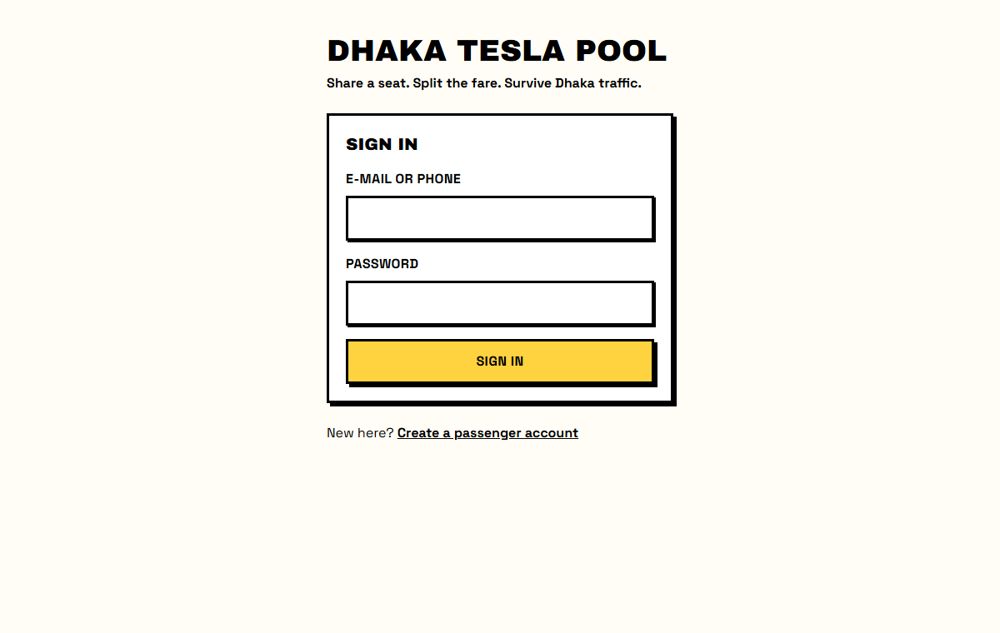
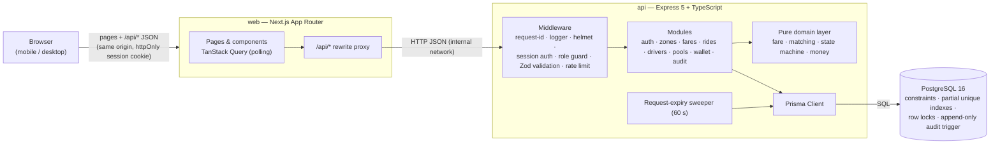
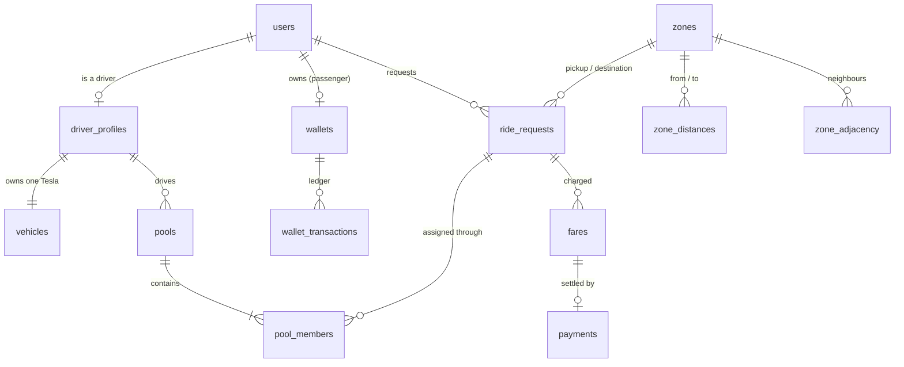

# Dhaka Tesla Pool — Ride Pooling & Shared Fares

A full-stack MVP for sharing Dhaka's three-wheeled Teslas. Passengers request a ride between city zones and may share it; drivers accept compatible requests into one trip without ever exceeding their Tesla's seats; every passenger pays an individual, hand-checkable fare. Built with Next.js, an Express + TypeScript API and PostgreSQL, and run with one Docker Compose command.

| | |
|---|---|
| **Demo video** | _Link added with the v1.0.0 release_ |
| **Deployment** | _See [Deployment](#deployment)_ |
| **Requirements** | [SRS](docs/SRS.md) · [traceability workbook](docs/DhakaPool_SRS_Tracker.xlsx) |
| **Design** | [Architecture](docs/ARCHITECTURE.md) · [ERD](docs/ERD.md) · [ADRs](docs/adr/README.md) · [Coding conventions](docs/CODING_CONVENTIONS.md) · [Scaling notes](docs/SCALING.md) |

---

## Contents

1. [The problem](#the-problem)
2. [Features](#features)
3. [Quick start (Docker)](#quick-start-docker)
4. [Demo accounts](#demo-accounts)
5. [Architecture](#architecture)
6. [Data model](#data-model)
7. [Tech stack and why](#tech-stack-and-why)
8. [Project structure](#project-structure)
9. [Local development](#local-development)
10. [Environment variables](#environment-variables)
11. [Tests](#tests)
12. [API overview](#api-overview)
13. [Business rules](#business-rules)
14. [Concurrency: the last-seat problem](#concurrency-the-last-seat-problem)
15. [Key decisions and trade-offs](#key-decisions-and-trade-offs)
16. [Known limitations](#known-limitations)
17. [Next improvements](#next-improvements)
18. [Deployment](#deployment)

---

## The problem

At rush hour in Banani, Nusrat is going to Mohakhali and Rafiq to Gulshan 1. Both wait for a Tesla, and each pays for a whole vehicle that could have carried them together. Jashim's Tesla, **Bullet**, has three seats.

Dhaka Tesla Pool lets them share Bullet safely:

- **Pooling is explicit.** A passenger opts in; the driver accepts each compatible request into the trip.
- **Capacity is a hard limit.** Bullet can never carry more than three seats, even when Nusrat and Shirin claim the last seat at the same instant.
- **Fares are individual and understandable.** Each passenger pays for their own distance, with a pool discount only when the Tesla really was shared.
- **The lifecycle is clear.** Every ride and every trip has a documented state machine, and every change is recorded.

## Features

**Passenger (Nusrat, Rafiq, Shirin)**
- Sign up and sign in; optional self-declared gender, used only for the same-gender option.
- Request a ride: pickup and destination zone, seats, share or ride alone, same-gender ride, TeslaPay or cash.
- See the solo and shared price before requesting.
- Follow the ride live: *Finding a Tesla → Driver on the way → Driver is here → On the way → Completed*, with the driver, Tesla, plate and co-rider count (never co-riders' names).
- Cancel while allowed, with the cost stated before confirming (free before the driver arrives, ৳20 after).
- Ride history with a full timeline and fare breakdown.
- TeslaPay wallet: balance, simulated top-up (৳50–৳5,000) and statement.

**Driver (Jashim with Bullet)**
- Go online in a zone or offline; locked while a trip is under way.
- See only the waiting requests that fit the Tesla and can join the current trip, and accept them.
- Manage the trip: arrived at pickup, start (fixes every fare), drop off each passenger in any order, mark a no-show, record cash collected, cancel before the start.
- Trip history with each passenger's fare and payment.

**Pool and fares**
- Several requests share one Tesla; occupied seats never exceed capacity.
- Each passenger gets an individual fare; the pool discount applies only if two or more passengers actually rode together.
- Optional women-only / men-only trips.
- Every status change is written to an append-only audit trail.



## Quick start (Docker)

Prerequisites: **Docker** with Compose v2. Nothing else is needed.

```bash
git clone <this repository>
cd <repository folder>
cp .env.example .env
docker compose up --build
```

| Service | URL |
|---|---|
| Web app | http://localhost:3000 |
| API health | http://localhost:4000/health → `{"status":"ok","db":"up"}` |

On start the API applies the database migrations and seeds the Dhaka zones and the demo personas. Both steps are idempotent, so restarting is safe. `.env` is optional for Docker: without it, Compose uses the same defaults as `.env.example`.

If port 5432 is already taken on your machine, set `DB_PORT` in `.env` (for example `5433`).

## Demo accounts

Every seeded persona uses the demo password **`TeslaPool#2026`** (set by `SEED_DEMO_PASSWORD`; demo data only, not a secret).

| Persona | Sign in with | Role | Seeded state |
|---|---|---|---|
| Nusrat | `nusrat@dhakapool.test` | Passenger (female) | TeslaPay ৳500.00 |
| Rafiq | `rafiq@dhakapool.test` | Passenger (male) | TeslaPay ৳0.00, pays cash |
| Shirin | `shirin@dhakapool.test` | Passenger (female) | TeslaPay ৳200.00 |
| Jashim | `jashim@dhakapool.test` | Driver | **Bullet**, 3 seats, `DHAKA-TESLA-11`, offline |
| Kamal | `kamal@dhakapool.test` | Driver | **Toofan**, 3 seats, `DHAKA-TESLA-22`, offline |

**A two-minute tour (scenario E1):** sign in as Jashim in one browser and go online in Banani. In another browser (or a private window), sign in as Nusrat and request Banani → Mohakhali, shared, TeslaPay; then as Rafiq request Banani → Gulshan 1, shared, cash. Jashim accepts both, marks *Arrived*, *Start*, and drops them off. Nusrat pays ৳66.00 from TeslaPay and Rafiq ৳60.00 in cash (their solo fares would be ৳75.00 and ৳67.50).

## Architecture

A modular monolith: one Next.js web app, one Express API and one PostgreSQL database ([ADR-0001](docs/adr/0001-modular-monolith.md)). Every rule that matters — capacity, transitions, wallet balance — needs one ACID transaction, so splitting services would add distributed consistency without solving a real problem.



- **The browser talks to one origin.** Next.js forwards `/api/*` to the API, so the session cookie stays first-party: no CORS preflights and no `SameSite=None` cookies ([ADR-0005](docs/adr/0005-db-sessions-and-same-origin-proxy.md)).
- **Every API module has the same four layers:** routes → controller → service → repository. Services own the transactions; the domain layer is pure and has no I/O.
- **Live status uses polling** every 4 s while a ride or trip is active, and stops when it ends or the tab is hidden ([ADR-0010](docs/adr/0010-polling-for-status-updates.md)).

Details: [ARCHITECTURE.md](docs/ARCHITECTURE.md), including the request pipeline, key flows and security.

## Data model

Fifteen tables. A **ride request** belongs to one passenger; a **pool** is one Tesla trip; **pool members** join them. Fares, payments and the TeslaPay ledger are separate, immutable records, and `status_history` keeps every transition.



Money is always integer **paisa** (1 taka = 100 paisa) in 64-bit columns; distances are integer metres. The full diagram, table dictionary, constraints and indexes are in [ERD.md](docs/ERD.md).

## Tech stack and why

| Layer | Choice | Why | Record |
|---|---|---|---|
| Web | Next.js (App Router), TanStack Query, react-hook-form, Tailwind CSS | Mandated React/Next.js; server layouts guard routes by role; polling and cache invalidation in a few lines | [ADR-0012](docs/adr/0012-frontend-nextjs-tanstack-query-tailwind.md) |
| Visual style | Neo-brutalism: thick black borders, hard shadows, flat colours | High contrast and visible focus by default; one token file and a small UI kit | [ADR-0013](docs/adr/0013-neo-brutalist-ui-style.md) |
| API | Express 5 + TypeScript (strict) | Small, well-known, explicit middleware pipeline; nothing hidden | [ADR-0003](docs/adr/0003-express-typescript.md) |
| API style | REST/JSON with command endpoints (`/arrive`, `/start`, `/cancel`) | Each state transition is one explicit, validated command | [ADR-0007](docs/adr/0007-rest-with-command-endpoints.md) |
| Database | PostgreSQL 16 | Row locks, CHECK constraints and partial unique indexes enforce the rules at the source | [ADR-0002](docs/adr/0002-postgresql.md) |
| Data access | Prisma, plus hand-written SQL migrations for integrity constraints | Typed queries and migrations; the constraints Prisma cannot express stay in SQL | [ADR-0004](docs/adr/0004-prisma-with-hand-written-integrity-sql.md) |
| Auth | Server-side sessions in the database, httpOnly cookie, bcrypt | Revocable sign-out, no tokens in JavaScript | [ADR-0005](docs/adr/0005-db-sessions-and-same-origin-proxy.md) |
| Validation | Zod schemas shared by the API and the web forms | One definition of every rule the user can break | [ADR-0008](docs/adr/0008-npm-workspaces-monorepo.md) |
| Concurrency | Row locks + compare-and-set + database constraints | See [Concurrency](#concurrency-the-last-seat-problem) | [ADR-0006](docs/adr/0006-concurrency-row-locks-cas-constraints.md) |
| Tests | Vitest + Supertest against a real PostgreSQL | Locks and constraints only behave truthfully on the real engine | [ADR-0011](docs/adr/0011-testing-vitest-supertest-real-postgres.md) |
| Runtime | Docker Compose, Node 24 on Debian slim images | One command on any machine | [ADR-0009](docs/adr/0009-docker-first-deployment.md) |

Deliberately **not** used: microservices, message queues, Redis, WebSockets, Kubernetes. None solves a problem the MVP has; the [scaling notes](docs/SCALING.md) say when each would become worth it.

## Project structure

```text
.
├── apps/
│   ├── api/                 Express + TypeScript API
│   │   ├── prisma/          schema, migrations (incl. hand-written integrity SQL), seed
│   │   ├── src/
│   │   │   ├── config/      env.ts (validated settings) · rules.ts (business constants)
│   │   │   ├── domain/      pure rules: fare, matching, state machine, cancellation, money
│   │   │   ├── modules/     one folder per feature: routes · controller · service · repository
│   │   │   ├── middleware/  request id, logging, sessions, auth, validation, errors
│   │   │   ├── db/          Prisma client, transactions, row locks, error mapping
│   │   │   └── jobs/        request-expiry sweeper
│   │   └── test/            integration, concurrency, domain and end-to-end tests
│   └── web/                 Next.js app
│       └── src/
│           ├── app/         (auth) · (passenger) · (driver) route groups
│           ├── components/  ui/ (neo-brutalist kit) · rides/ · pools/
│           └── lib/         API client, query hooks and keys, labels, formatting
├── packages/shared/         enums, Zod schemas, API types, transition tables
├── scripts/                 load-smoke.mjs (performance smoke test)
├── docker/                  database init (creates the test database)
└── docs/                    SRS, architecture, ERD, ADRs, conventions, tracker
```

## Local development

For working on the code without rebuilding images. Requires **Node 24** (see `.nvmrc`) and npm.

```bash
cp .env.example .env
npm ci
docker compose up -d db        # only PostgreSQL (also creates dhakapool_test)
npm run db:migrate             # apply migrations
npm run db:seed                # zones and demo personas
npm run dev:api                # API on http://localhost:4000 (restarts on change)
npm run dev:web                # web app on http://localhost:3000 (in another terminal)
```

Outside production, the sign-in page lists the demo accounts and `/styleguide` shows every UI component.

| Task | Command |
|---|---|
| Lint, type-check and test everything (run before every commit) | `npm run lint && npm run typecheck && npm test` |
| Format | `npm run format` |
| Build all workspaces | `npm run build` |
| Load smoke test against a running API | `npm run load:smoke` |

## Environment variables

All variables are listed with safe defaults in [`.env.example`](.env.example). Real secrets are never committed; `.env` is git-ignored.

| Variable | Default | Purpose |
|---|---|---|
| `POSTGRES_USER` · `POSTGRES_PASSWORD` · `POSTGRES_DB` | `dhakapool` · `change-me` · `dhakapool` | Database container |
| `DB_PORT` | `5432` | Host port of the database |
| `DATABASE_URL` · `DIRECT_URL` | local Postgres | API connection (pooled) and migrations (direct) |
| `TEST_DATABASE_URL` | `…/dhakapool_test` | Tests only; never the development database |
| `API_PORT` · `WEB_ORIGIN` · `LOG_LEVEL` | `4000` · `http://localhost:3000` · `info` | API |
| `SESSION_TTL_HOURS` · `COOKIE_SECURE` · `BCRYPT_COST` | `168` · `false` · `12` | Sessions and password hashing; set `COOKIE_SECURE=true` behind HTTPS |
| `TRUST_PROXY_HOPS` | `1` | Proxies in front of the API, for per-client rate limits; `2` when hosted behind Vercel and Render |
| `SEED_DEMO_PASSWORD` | `"TeslaPool#2026"` | Password of every seeded persona. Keep the quotes: without them Node reads `#` as a comment |
| `API_INTERNAL_URL` | `http://localhost:4000` | Where the web app forwards `/api/*` (fixed at build time) |
| `FARE_BASE_PAISA` · `FARE_PER_KM_PAISA` · `FARE_POOL_DISCOUNT_BPS` | `3000` · `1500` · `2000` | Fare rates: ৳30 base, ৳15/km, 20 % pool discount on the distance charge |
| `CANCELLATION_FEE_PAISA` · `NO_SHOW_WAIT_MINUTES` | `2000` · `5` | ৳20 fee after the driver arrives; wait before a no-show |
| `REQUEST_EXPIRY_MINUTES` · `POOL_JOIN_WINDOW_MINUTES` | `15` · `10` | Unmatched requests expire; how late a request may join a trip |

Business rules are tuned here, not in code: change a value, restart the API. [CODING_CONVENTIONS.md §10](docs/CODING_CONVENTIONS.md) lists how to change each rule safely.

## Tests

```bash
docker compose up -d db && npm test          # on your machine
docker compose run --rm api npm test         # inside Docker
```

244 automated tests (231 API, 13 shared) run against a real PostgreSQL test database, never a mock, because locks and constraints only behave truthfully on the real engine. Test names read as examples with the personas, for example *"rejects Shirin when Bullet's last seat is already taken"*.

| Risk | What proves it | Where |
|---|---|---|
| Bullet's capacity can never be exceeded | Accept refuses a request that does not fit; the database CHECK refuses it too | `apps/api/test/pools/accept.test.ts`, `test/db/constraints.test.ts` |
| Invalid state transitions are rejected | The full transition matrix, and every command from every wrong state | `test/domain/state-machine.test.ts`, `test/pools/trip.test.ts` |
| Nusrat's and Rafiq's pooled fares are correct | The worked examples: ৳66.00 and ৳60.00 shared, ৳75.00 and ৳67.50 alone | `test/domain/fare.test.ts`, `test/e2e/scenarios.test.ts` |
| Users cannot modify another user's ride | Another passenger's ride and another driver's trip answer 404 | `test/auth/access.test.ts`, `test/pools/trip.test.ts` |
| Cancellation rules hold | Free before arrival, ৳20 after, refused once started | `test/rides/cancel.test.ts`, `test/wallet/fees.test.ts` |
| Concurrent requests cannot corrupt capacity | Nusrat and Shirin race for the last seat, and Jashim and Kamal race for one request, each 20 times over real HTTP | `test/pools/concurrency.test.ts` |

`test/e2e/scenarios.test.ts` runs the SRS scenarios E1–E5 end to end through the API, and every wallet test checks that each balance still equals the sum of its ledger.

**Performance:** `npm run load:smoke` runs 20 concurrent users for 60 s over the most used read endpoints. On a local Docker stack: 87,367 requests, 0 failed, p95 26.5 ms (target: under 300 ms).

## API overview

REST over JSON. Every route except sign-up, sign-in and health needs a session; each checks the role and the ownership of the resource.

| Method & path | Who | Purpose |
|---|---|---|
| `POST /api/auth/signup` · `/login` · `/logout`, `GET /api/auth/me` | Anyone | Accounts and session |
| `GET /api/zones` | Signed in | The zone list |
| `POST /api/fares/estimate` | Passenger | Solo and shared price for a trip |
| `POST /api/rides`, `GET /api/rides?scope=active\|history`, `GET /api/rides/:id` | Passenger (owner) | Request a ride, list, view with timeline |
| `POST /api/rides/:id/cancel` | Passenger (owner) | Cancel, with the fee rules |
| `GET /api/wallet`, `GET /api/wallet/transactions`, `POST /api/wallet/topup` | Passenger | TeslaPay |
| `GET` · `PUT /api/driver/availability` | Driver | Status; go online in a zone or offline |
| `GET /api/driver/requests`, `POST /api/driver/requests/:id/accept` | Driver | Relevant waiting requests; accept into the trip |
| `GET /api/driver/pools?scope=active\|history` | Driver (owner) | Current trip and history |
| `POST /api/pools/:id/arrive` · `/start` · `/cancel` | Driver (owner) | Trip transitions |
| `POST /api/pools/:id/members/:rideId/complete` · `/no-show` · `/cash-collected` | Driver (owner) | Per-passenger transitions and cash |
| `GET /health` | Anyone | Liveness and database readiness |

Every error has the same shape, with a stable code and a message written for people:

```json
{ "error": { "code": "CAPACITY_EXCEEDED", "message": "Bullet has only 1 free seat.", "details": { "freeSeats": 1 } }, "requestId": "…" }
```

The full list of codes is in [SRS §8.2](docs/SRS.md#82-software-interface--rest-api-overview).

## Business rules

The rules are specified in [SRS §5–6](docs/SRS.md#6-business-rules); each is cited by its ID in the code.

**Lifecycle.** A passenger's ride and a Tesla's trip each have their own state machine, because five passengers can be at different stages of one trip.

```text
Ride:  REQUESTED → MATCHED → DRIVER_ARRIVED → STARTED → COMPLETED
           ↘ CANCELLED / EXPIRED (unmatched after 15 min)
Trip:  OPEN → DRIVER_ARRIVED → STARTED → COMPLETED   (or CANCELLED before the start)
```

**Who can share a Tesla (BR-02).** A request may join a trip only if: same pickup zone; everyone opted in to sharing; its destination is the same as, or adjacent to, every passenger's destination; it came within 10 minutes of the trip forming; the seats fit; and any same-gender rule is respected. Nusrat (→ Mohakhali) and Rafiq (→ Gulshan 1) can share because the two zones are neighbours; a Banani → Uttara request cannot join them.

**Fares (BR-10 to BR-12).** Per seat: `৳30 base + ৳15 per km − 20 % of the distance charge when pooled`. The estimate is shown at request time; the fare is fixed when the trip starts, and it counts as pooled only if two or more passengers start together.

| Passenger | Route | Alone | Shared |
|---|---|---|---|
| Nusrat | Banani → Mohakhali, 3.0 km | ৳30 + ৳45 = **৳75.00** | ৳75 − ৳9 = **৳66.00** |
| Rafiq | Banani → Gulshan 1, 2.5 km | ৳30 + ৳37.50 = **৳67.50** | ৳67.50 − ৳7.50 = **৳60.00** |

**Cancellation (BR-07).** Free before the driver arrives; ৳20 after arrival; not possible once the trip has started. A driver may mark a no-show 5 minutes after arriving (same fee) or cancel the trip before the start, which returns the passengers to the queue at no cost.

**Payment.** TeslaPay is debited at drop-off; if the balance is short, the ride falls back to cash. Cash rides stay *cash due* until the driver records the collection.

**Assumptions** are listed with their reasons in [SRS §13.1](docs/SRS.md#131-assumptions-register) — for example, pickup is the zone itself (A-02), and gender is optional, self-declared and never shown to co-riders (A-19, A-20).

## Concurrency: the last-seat problem

Bullet has one free seat. Nusrat and Shirin are both accepted at the same instant, and both requests first see one seat available. Exactly one must succeed.

**Now — four layers, all inside one PostgreSQL transaction** ([ADR-0006](docs/adr/0006-concurrency-row-locks-cas-constraints.md)):

1. **Serialise.** The accept locks the driver row and then the trip row (`SELECT … FOR UPDATE`). The second accept waits, then re-reads the seats and is refused with `CAPACITY_EXCEEDED`. Locks are always taken in the order driver → pool → ride → wallet, so two commands can never deadlock.
2. **Compare-and-set.** A status change is `UPDATE … WHERE id = ? AND status = ?` and must touch exactly one row, so a cancel racing an accept, or two drivers accepting the same request, cannot both win.
3. **Database constraints.** `CHECK (occupied_seats BETWEEN 0 AND capacity)`, a non-negative wallet balance, and partial unique indexes (one active ride per passenger, one active trip per driver) hold even if application code were wrong.
4. **Atomicity.** Membership, seats, fares, payments, ledger and audit rows commit together or not at all.

Transactions are short (no network calls inside), `lock_timeout` is 3 s, and PostgreSQL's default READ COMMITTED isolation is enough because every decision is made after taking the lock. The concurrency tests run each race 20 times over real HTTP, with fresh data every time.

**At larger scale.** One database and row locks are right for this MVP, but a city-wide service would change:
- give each trip a single writer by partitioning matching per pickup zone or geo cell, instead of relying on lock contention;
- add idempotency keys to every command, so retries are safe;
- move matching to geo-indexed search (H3 cells or PostGIS);
- serve history from read replicas and cache reference data;
- replace polling with push (WebSockets or SSE);
- run the expiry sweep as one scheduled job instead of one per API instance.

The full reasoning for 1M passengers and 100k drivers — load estimate, target architecture, and each topic from load balancing to deployment — is in [docs/SCALING.md](docs/SCALING.md).

## Key decisions and trade-offs

| Decision | Alternative | Why |
|---|---|---|
| Zones with a fixed distance and adjacency table | Real routing / map API | Deterministic, hand-checkable fares and matching; the brief asks not to rebuild maps |
| Two state machines (ride and trip) | One combined lifecycle | Passengers in one trip can be at different stages (one dropped off, one still riding) |
| Fare fixed at trip start; pooled only if 2+ passengers start together | Fix at request, or at drop-off | The discount is given only when the Tesla really was shared, and the price cannot change after boarding |
| Integer paisa everywhere | Decimal or floating point | Exact arithmetic; the worked examples can be checked by hand |
| Pessimistic row locks for trips | Optimistic versioning with retries | Contention is local to one Tesla; a short lock is simple to reason about and test |
| Polling every 4 s | WebSockets | Enough for the MVP with far fewer moving parts; push is the upgrade path |
| Database sessions behind a same-origin proxy | JWT in local storage | Revocable sign-out, no token readable by scripts, no CORS setup |
| Tests on real PostgreSQL | Mocks or SQLite | Locks and constraints are exactly what needs proving |
| Driver accepts each request explicitly | Automatic dispatch | Matches the brief ("accept a ride/pool") and keeps the driver in control |

All decisions and their alternatives are logged in [SRS §13.2](docs/SRS.md#132-decisions-log) and the [ADRs](docs/adr/README.md).

## Known limitations

- Geography is ten Dhaka zones (Banani, Gulshan 1 and 2, Mohakhali, Tejgaon, Farmgate, Dhanmondi, Mirpur, Uttara, Bashundhara); pickup is the zone, not an address.
- Status updates arrive by polling, so a change can take up to 4 s to appear.
- TeslaPay is simulated: top-ups are free, and there is no hold on the balance between request and drop-off (a short balance falls back to cash).
- A cancellation fee on a cash ride is recorded as unpaid; collecting it later is not implemented.
- Gender is self-declared and not verified.
- One API instance is assumed: sign-in rate limits and the zone cache live in memory, and each instance would run its own expiry sweep (still correct, just redundant).

## Next improvements

Real routing and ETAs with detour-based matching; live GPS; push updates; automatic dispatch across drivers; ratings; an admin console; notifications; surge pricing; wallet pre-authorisation; collecting unpaid fees; driver onboarding; more cities. See [SRS §13.4](docs/SRS.md#134-out-of-scope--next-improvements).

## Deployment

Docker Compose runs the full stack anywhere (see [Quick start](#quick-start-docker)). The hosted demo uses three free tiers, with no payment method required ([ADR-0009](docs/adr/0009-docker-first-deployment.md), [ARCHITECTURE §12.2](docs/ARCHITECTURE.md#122-later-free-tier-hosting-nfr-por-04-adr-0009)):

| Part | Host | Configuration |
|---|---|---|
| Web app | Vercel (Hobby) | [`apps/web/vercel.json`](apps/web/vercel.json) |
| API | Render (free web service, same Dockerfile) | [`render.yaml`](render.yaml) |
| Database | Supabase (free) | connection strings below |

Railway was the first choice in ADR-0009, but its free plan ($1 of credit a month) cannot keep a service running, so the API uses the documented fallback, Render.

**1. Database — Supabase.** Create a project in the *Southeast Asia (Singapore)* region and note the database password. Under **Connect**, copy the **Session pooler** connection string (IPv4; Render has no IPv6, so the direct connection cannot be used). From it make two values:

```text
DATABASE_URL = postgresql://postgres.<ref>:<password>@<pooler-host>:5432/postgres?sslmode=no-verify
DIRECT_URL   = postgresql://postgres.<ref>:<password>@<pooler-host>:5432/postgres?sslmode=require
```

The app connects through node-postgres, which reads `sslmode=require` as "verify the certificate" and would reject Supabase's; `no-verify` keeps the connection encrypted. Migrations run through Prisma, which accepts `sslmode=require`.

**2. API — Render.** *New → Blueprint*, connect this repository and choose the branch to deploy (`release/v1.0.0` for the release). Render reads `render.yaml` and asks for the secret values: `DATABASE_URL`, `DIRECT_URL`, `SEED_DEMO_PASSWORD` (`TeslaPool#2026`, no quotes in the dashboard) and `WEB_ORIGIN` (the Vercel address from step 3; enter a placeholder first and update it afterwards). On start the container migrates and seeds the database. Check `https://<api-name>.onrender.com/health`.

**3. Web — Vercel.** *Add New → Project*, import this repository, and set **Root Directory** to `apps/web`. Add the environment variable `API_INTERNAL_URL = https://<api-name>.onrender.com` for all environments before the first build, because the `/api` rewrite is fixed at build time. Deploy, then put the Vercel address into `WEB_ORIGIN` on Render and redeploy the API.

**Before a demo.** Free services sleep: open the API's `/health` first and wait for `{"status":"ok","db":"up"}` (Render needs about a minute to wake after 15 idle minutes). A Supabase project pauses after a week without activity and is resumed from its dashboard.
