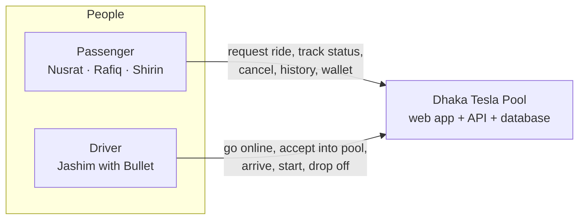
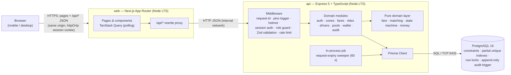
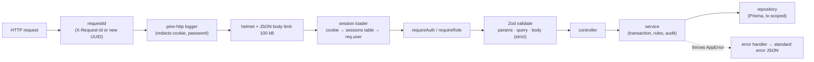
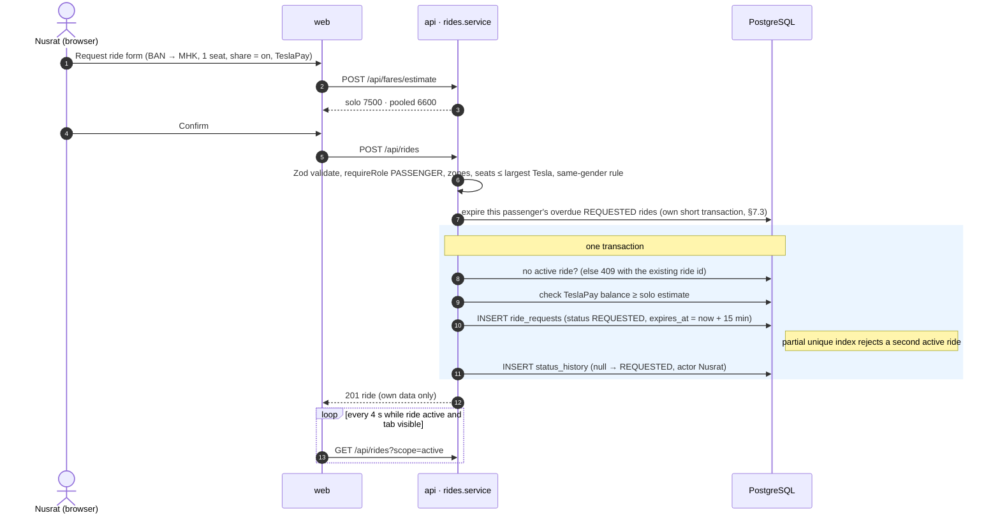
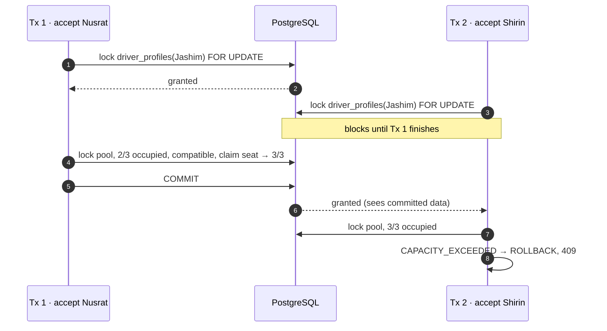
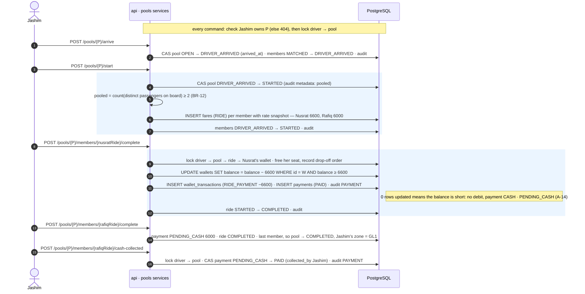
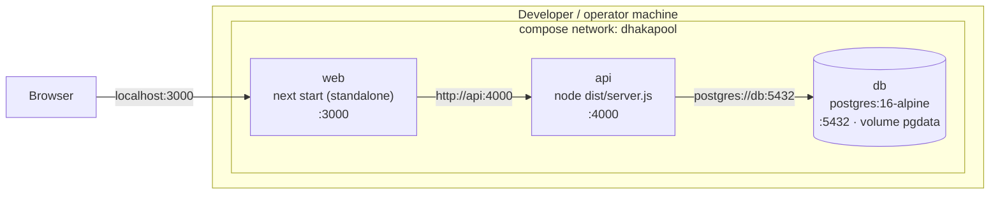
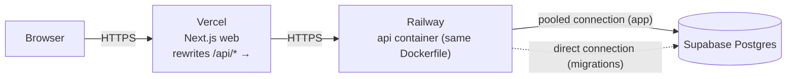

# Architecture — Dhaka Tesla Pool (MVP)

| Field | Value |
|---|---|
| Document ID | DTP-ARC-001 |
| Version | 0.11 (Draft for review) |
| Author | Golam Mahadi Ahmed |
| Implements | [SRS DTP-SRS-001 v0.4](SRS.md) |
| Related | [ERD](ERD.md) · [Architecture Decision Records](adr/README.md) · [Traceability workbook](DhakaPool_SRS_Tracker.xlsx) |

| Version | Date | Change |
|---|---|---|
| 0.1 | 2026-09-24 | Initial architecture: containers, module layout, key flows, concurrency strategy, security, deployment |
| 0.2 | 2026-09-24 | Same-gender ride option (SRS BR-18): matching reason, pool restriction maintenance, data minimisation |
| 0.3 | 2026-09-24 | Synced with the project setup: `config/rules.ts` and `logger.ts` in the layout, Node-based container health checks on `node:24-bookworm-slim` images, `DB_PORT` variable |
| 0.4 | 2026-09-24 | Synced with the auth module: rate limiting keyed on the client IP behind one trusted proxy hop; sign-out returns 204 |
| 0.5 | 2026-09-24 | Synced with the zones and fares modules: the domain layer may use `@dhakapool/shared` types; zone reference data cached in memory; fare breakdown shape and `CURRENT_FARE_RATES`; test folder layout as built |
| 0.6 | 2026-09-24 | Synced with the rides and audit modules: transition tables in the shared package, service function names, passenger expiry in its own transaction before each command, `command.rejected` WARN log |
| 0.7 | 2026-09-24 | Synced with the drivers and pools modules: `GET /api/driver/availability`, matching signature and reasons as built, file-level service names, passenger cancel in MATCHED (pool lock, one re-read) |
| 0.8 | 2026-09-24 | Synced with the trip lifecycle: driver commands lock driver → pool after an ownership check, §6.4 and §6.5 as built, new §6.6 (driver cancels the trip, no-show), pool service names |
| 0.9 | 2026-09-24 | Synced with the wallet module: settlement service, cash collection on the pools routes, PAYMENT audit entity, cash fall-back and unpaid fees, unreachable-database codes mapped to 503 |
| 0.10 | 2026-09-24 | Neo-brutalist visual style (ADR-0013) in §10; implements SRS v0.4 |
| 0.11 | 2026-09-25 | Synced with the passenger UI: session guard in `lib/server-session.ts`, per-screen query hooks, cursor-paged lists, polling as built, taka-to-paisa top-up input, web layout in §11 |

> **Rule for this document (DR-06, DR-18):** the code must broadly match this document. When the implementation diverges, update this file and the relevant ADR in the same pull request.

---

## 1. Architecture drivers

Only a handful of SRS requirements actually shape the architecture. Everything else is a detail inside the chosen shape.

| # | Driver | SRS source | Architectural consequence |
|---|---|---|---|
| AD-1 | Bullet's seats can never be overbooked, even when two accepts arrive at the same instant | FR-POOL-02, NFR-CON-01…04 | A single relational database with transactions, row locks and constraints. Every seat change goes through one service code path. |
| AD-2 | Only legal lifecycle transitions, by the right actor | BR-06, SRS §5 | One table-driven state-machine module. Transitions are explicit command endpoints, never a generic "set status". |
| AD-3 | A user touches only their own data | NFR-SEC-03 | Ownership checks in the service layer, which is the single choke point. The UI is never trusted. |
| AD-4 | Every ride is fully auditable after the fact | FR-HIST-01…04 | The audit row is written in the same transaction as the change it records. The audit table is append-only, enforced by a database trigger. |
| AD-5 | Fares are exact and hand-checkable | BR-10…14 | Pure fare function over integer paisa, in a separate `domain/` layer. |
| AD-6 | Runs anywhere with `docker compose up`, on free tiers | NFR-POR-01, DC-04 | Three containers, no third-party runtime dependencies. |
| AD-7 | No complexity without a demonstrated need; code must be easy to trace, debug and change | DC-05, PRD §8–9 | A modular monolith with conventional layers. No queues, Redis, microservices or implicit framework behaviour. |

## 2. Architectural style

The system is a **modular monolith** with three runtime containers:
- a **Next.js** web app, which is UI only;
- an **Express + TypeScript** API, which holds all business logic;
- **PostgreSQL**, which is the source of truth and the final guard on integrity.

Three things keep the monolith modular:
- **Domain modules:** auth, zones, fares, rides, drivers, pools, wallet, audit. A module may call another module's *service*, never its repository.
- **Strict layers inside the API:** routes → controller → service → repository.
- **A pure `domain/` layer:** fare, matching, state machine, money. It has no I/O, so it can be unit-tested in isolation.

Why not microservices, a queue or a cache: see ADR-0001 and DC-05. Every rule that matters (capacity, transitions, wallet balance) needs a single ACID transaction. Splitting services would force distributed consistency to solve a problem we don't have.

## 3. System context



There are no external systems. Maps, payment gateways, SMS and e-mail are out of scope (SRS §1.2, DC-06).

## 4. Container view (PRD §9 minimum: Browser → Next.js → Node.js API → Database)



| Container | Responsibility | Does not do |
|---|---|---|
| **web** | Rendering, routing, forms, client-side validation for UX, polling, and proxying `/api/*` to the API so that the browser talks to one origin | Business rules, direct DB access, authorization decisions |
| **api** | Authentication, authorization, validation, all business rules, transactions, audit, logging, the expiry job | HTML rendering |
| **db** | Durable state, and the final guarantee of every integrity rule (CHECK, unique, FK, trigger) | Business workflows (no stored procedures beyond the audit guard) |

**Why the proxy (ADR-0005).** The browser calls `https://<web-origin>/api/...`, and Next.js rewrites the call to `API_INTERNAL_URL`. Session cookies are therefore first-party. This means:
- no CORS preflights;
- no `SameSite=None` cookies;
- no third-party-cookie blocking when the web app and API are later hosted on different domains (Vercel and Railway).

## 5. API internal structure

### 5.1 Request pipeline



### 5.2 Layer rules

| Layer | May depend on | Contains | Must not contain |
|---|---|---|---|
| `routes` | controller, middleware | Path, method, auth/role/validation middleware | Logic |
| `controller` | service, shared schemas | Read the validated input, call the service, map to a response DTO (e.g. hide co-rider data, A-09) | Transactions, SQL, rules |
| `service` | repositories, domain, other modules' services, audit | Use-case orchestration, **transaction boundaries**, ownership checks, locking, audit writes | HTTP objects (`req`/`res`) |
| `repository` | Prisma `TransactionClient` | Queries. Every function takes the `tx` it runs in. | Rules, HTTP |
| `domain` | nothing but `@dhakapool/shared` types and tables (pure) | `fare.ts`, `matching.ts`, `pool-restriction.ts`, `state-machine.ts`, `cancellation.ts`, `money.ts`, `errors.ts` | I/O, Prisma, Date.now (time is passed in) |

**Transactions are owned by services.** A service opens `withTransaction(async (tx) => { … })` and passes `tx` to every repository call and to `audit.record(tx, …)`. Either everything commits together or nothing does (NFR-CON-02, FR-HIST-01).

### 5.3 Modules and endpoints

| Module | Endpoints (SRS §8.2) | Key service functions |
|---|---|---|
| `auth` | `POST /api/auth/signup`, `/login`, `/logout`, `GET /api/auth/me` | `signUp`, `logIn` (creates session), `logOut` (revokes), `getMe` |
| `zones` | `GET /api/zones` | `listZones`, `distanceBetween` (BR-09), `areNeighbours` (BR-08). Reference data is read once and kept in memory; a failed read is not cached. |
| `fares` | `POST /api/fares/estimate` | `estimateFare({ pickupZoneCode, destinationZoneCode, seats })` → distance, rates, and the solo and pooled breakdowns |
| `rides` | `POST /api/rides`, `GET /api/rides`, `GET /api/rides/:id`, `POST /api/rides/:id/cancel` | `createRide`, `listRidesForPassenger`, `getRideForPassenger` (`rides.service.ts`); `cancelRideByPassenger` (`ride-cancellation.service.ts`); `expireOverdueRides(tx, passengerId?)` (`ride-expiry.service.ts`); `toRideView` (`ride-view.ts`) |
| `drivers` | `GET` · `PUT /api/driver/availability`, `GET /api/driver/requests`, `POST /api/driver/requests/:id/accept`, `GET /api/driver/pools` | `getDriverStatus`, `setAvailability`, `loadDriver`, `assertOnline` (`drivers.service.ts`); `listRelevantRequests` (`request-feed.service.ts`); accept delegates to `pools` |
| `pools` | `POST /api/pools/:id/arrive`, `/start`, `/cancel`, `POST /api/pools/:id/members/:rideId/complete`, `/no-show`, `/cash-collected` | `acceptRequest` (`accept-request.service.ts`); `markArrived`, `startTrip` (locks fares) (`trip.service.ts`); `dropOff` (`drop-off.service.ts`); `cancelTrip`, `markNoShow` (`cancel-trip.service.ts`); `lockPoolOfRide`, `leavePoolBeforeStart` (`leave-pool.service.ts`); `lockOwnPool` (`own-pool.ts`), `movePool` (`pool-moves.ts`); `lockActivePool`, `getPoolView`, `listDriverPools` (`pools.service.ts`); later `markCashCollected` |
| `wallet` | `GET /api/wallet`, `GET /api/wallet/transactions`, `POST /api/wallet/topup` | `getWallet`, `getStatement`, `topUp`, `getBalancePaisa(tx, …)`, `debitForRide(tx, …)` (guarded debit, returns null when short) (`wallet.service.ts`); `settleRideFare(tx, …)`, `collectCash(tx, …)`, `chargeCancellationFee(tx, …)` (`settlement.service.ts`). `POST /api/pools/:id/members/:rideId/cash-collected` is a driver route in `pools` that calls `collectCash`. |
| `audit` | *(internal)* | `recordTransition(tx, { entityType, entityId, fromStatus, toStatus, actor, reason })`, `recordTransitions(tx, [...])`, `listTimeline(entityType, entityId)` |
| `health` | `GET /health` | DB `SELECT 1` → `{ status, db }` |

### 5.4 Pure domain layer

- **`fare.ts`** implements BR-10 exactly: `computeFare({ distanceM, seats, pooled, rates }) → { pooled, seats, basePaisa, distanceChargePaisa, discountPaisa, farePerSeatPaisa, totalPaisa }` (the shared `FareBreakdown` type). Integers in, integers out. The current rates are `CURRENT_FARE_RATES` in `config/rules.ts`; the caller passes them in, so the function never reads the environment.
- **`money.ts`** holds `roundHalfUpDiv(numerator, denominator)`. It rounds with the integer remainder, so no floating-point division is involved (BR-13).
- **`matching.ts`** implements BR-02: `isCompatible(request, pool, rules) → { ok: true } | { ok: false, reason }`. `pool` carries its active members; `rules` carries the join window and an `areNeighbours(a, b)` function built from the cached adjacency list, so the function stays pure. The join window compares the request's `requested_at` with the pool's `created_at`, so no clock is needed. The checks run in a fixed order and the first failure is the reason: `POOL_NOT_OPEN`, `NOT_OPTED_IN` (including private pools), `DIFFERENT_PICKUP`, `NO_SEATS`, `JOIN_WINDOW_PASSED`, `DESTINATION_NOT_ADJACENT`, `GENDER_RESTRICTED` (BR-18). `pools/match-refusal.ts` maps `POOL_NOT_OPEN` and `NO_SEATS` to 409 (`POOL_NOT_OPEN`, `CAPACITY_EXCEEDED`) and the rest to 422 `NOT_COMPATIBLE` with the reason in `details`.
- **`cancellation.ts`** gives `cancellationPolicy(status) → FREE | FEE | FORBIDDEN` (BR-07). Whether cancelling is allowed at all comes from the state machine.
- **`pool-restriction.ts`** computes `genderRestriction(members) → NONE | FEMALE_ONLY | MALE_ONLY` and `fitsRestriction(restriction, gender)` (BR-18). The pools services store the result on the pool whenever a member joins or leaves, inside the same locked transaction.
- **`state-machine.ts`** checks moves against the SRS §5 transition tables. The tables are data in `packages/shared/src/transitions.ts` (`RIDE_TRANSITIONS`, `POOL_TRANSITIONS`), so the web app can derive its buttons from the same source:

```ts
// actors allowed per (from → to)
export const RIDE_TRANSITIONS: TransitionTable<RideStatus> = {
  REQUESTED:      { MATCHED: ['DRIVER'], CANCELLED: ['PASSENGER'], EXPIRED: ['SYSTEM'] },
  MATCHED:        { DRIVER_ARRIVED: ['DRIVER'], CANCELLED: ['PASSENGER'], REQUESTED: ['DRIVER'] },
  DRIVER_ARRIVED: { STARTED: ['DRIVER'], CANCELLED: ['PASSENGER', 'DRIVER'], REQUESTED: ['DRIVER'] },
  STARTED:        { COMPLETED: ['DRIVER'] },
  COMPLETED: {}, CANCELLED: {}, EXPIRED: {},
};
assertRideMove(from, to, actor); // not in the table → 409 INVALID_STATE_TRANSITION (assertPoolMove for pools)
```

The service uses the table to *decide* whether a transition is allowed, and the database compare-and-set (§7.2) to make sure the decision still holds at write time.

## 6. Key flows

### 6.1 Passenger requests a ride (Nusrat, Banani → Mohakhali)



### 6.2 Driver accepts into a pool — the critical path (AD-1)

```mermaid
sequenceDiagram
    autonumber
    actor J as Jashim (browser)
    participant A as api · pools.service
    participant DB as PostgreSQL
    J->>A: POST /api/driver/requests/{rafiqRide}/accept
    rect rgb(235, 245, 255)
    note over A,DB: BEGIN (READ COMMITTED) — lock order is always driver → pool → ride → wallet
    A->>DB: SELECT … FROM driver_profiles WHERE user_id = Jashim FOR UPDATE
    A->>A: must be ONLINE, else 409 DRIVER_OFFLINE
    A->>DB: SELECT active pool of Jashim FOR UPDATE
    alt no active pool
        A->>DB: INSERT pools (OPEN, capacity 3 copied from Bullet, occupied 0)
    else pool exists
        A->>A: pool must be OPEN, else 409 POOL_NOT_OPEN
    end
    A->>DB: SELECT ride + active members + adjacency
    A->>A: matching.isCompatible() and seats check, else 422 NOT_COMPATIBLE or 409 CAPACITY_EXCEEDED
    A->>DB: UPDATE ride_requests SET status = MATCHED WHERE id = R AND status = REQUESTED AND expires_at > now()
    note right of DB: 0 rows means someone else won, so 409 INVALID_STATE_TRANSITION and ROLLBACK
    A->>DB: INSERT pool_members (seats 1)
    A->>DB: UPDATE pools SET occupied_seats = occupied_seats + 1
    note right of DB: CHECK occupied_seats ≤ capacity is the last line of defence
    A->>DB: INSERT status_history (pool null → OPEN when new; ride REQUESTED → MATCHED)
    note over A,DB: COMMIT
    end
    A-->>J: 200 pool (2 / 3 seats)
```

### 6.3 The last-seat race (NFR-CON-01, PRD §12)

Bullet has 2/3 seats occupied. Accepts for **Nusrat** and **Shirin** arrive at the same instant, for example from a double tap or two open tabs.



If the two contenders are **different drivers racing for the same request**, the driver locks do not collide. The ride's compare-and-set (`WHERE status = 'REQUESTED'`) lets exactly one transaction win. The loser rolls back everything, including a pool it may have just created.

### 6.4 Trip lifecycle: arrive → start (fare lock) → drop-off (settlement)



### 6.5 Passenger cancels while matched (lock order preserved)

1. Find the ride's active membership without a lock, then lock its pool (`FOR UPDATE`) and read the membership again.
2. CAS the ride `MATCHED → CANCELLED` (or `DRIVER_ARRIVED → CANCELLED`). If 0 rows, the status changed meanwhile (for example a driver accepted): read it once more and cancel from the new status. Only a second change gives 409.
3. Mark the membership `left_at = now()` and decrement `occupied_seats`.
4. Recalculate the pool's gender restriction from the remaining members (FR-POOL-12).
5. If no active members remain, the system moves the pool to `CANCELLED` with reason `ALL_MEMBERS_CANCELLED` (FR-POOL-07).
6. Write audit rows, then COMMIT.

In `DRIVER_ARRIVED`, the same transaction also inserts the ৳20 `CANCELLATION_FEE` fare (FR-FARE-05). The wallet module then debits it, or marks the fee `UNPAID` for cash (BR-07, FR-PAY-05).

### 6.6 Driver ends things before the start

- **Cancel the trip** (`POST /pools/{P}/cancel`, PT-04): allowed in OPEN or DRIVER_ARRIVED. Every active member goes back to `REQUESTED` with `requested_at` and `expires_at` restarted, so the join window and the 15-minute expiry start again and another driver can accept them. All memberships get `left_at`, seats go to 0, the pool is `CANCELLED` with reason `DRIVER_CANCELLED_POOL`, and nobody is charged.
- **No-show** (`POST /pools/{P}/members/{ride}/no-show`, RT-09): allowed only for a DRIVER_ARRIVED member and only `NO_SHOW_WAIT_MINUTES` after `arrived_at`; before that, a 409 says how many minutes are left. The member is cancelled with reason `NO_SHOW`, the fee is recorded, and the member leaves the pool exactly as in §6.5.

## 7. Consistency & concurrency strategy (NFR-CON-01…06, ADR-0006)

### 7.1 Four layers of defence

| Layer | Mechanism | Protects against |
|---|---|---|
| 1. Serialize | `SELECT … FOR UPDATE` on `driver_profiles` and `pools` rows, inside one transaction, **always in the order driver → pool → ride → wallet** | Two seat claims interleaving between "check" and "write"; deadlocks (fixed order) |
| 2. Compare-and-set | `updateMany({ where: { id, status: expected } })` and require `count === 1` | Two different actors transitioning the same ride (two drivers, or a cancel racing an accept) |
| 3. Constraints | `CHECK (occupied_seats BETWEEN 0 AND capacity)`, `CHECK (balance_paisa >= 0)`, and partial unique indexes: one active ride per passenger, one active pool per driver, one active membership per ride | Any bug in layers 1–2, and direct SQL |
| 4. Atomicity | All side effects (membership, seats, fares, payments, ledger, audit) in the **same** transaction | Partial state after a crash or error |

### 7.2 Why this combination

- **Pessimistic locks rather than optimistic versioning** for pools. An accept reads several rows (members, adjacency) before deciding, and contention is local to one Tesla. A short row lock is simple to reason about and to test. Optimistic versioning would need retry loops for a hot, tiny resource.
- **Postgres's default isolation, READ COMMITTED**, is enough. After a `FOR UPDATE` wait, each statement sees the latest committed data. SERIALIZABLE would add serialization failures to retry without adding safety here.
- **Transactions are short.** They contain no network calls and no user think-time. The Prisma interactive transaction timeout is 5 s, and `lock_timeout` is 3 s, so a stuck lock becomes a fast 503 instead of a hang.
- **Constraint errors are mapped, not leaked:**
  - Postgres `23514` (check_violation) on `pools_occupied_seats_check` → 409 `CAPACITY_EXCEEDED`
  - `23505` (unique_violation) on `ride_requests_one_active_per_passenger` → 409 `ACTIVE_REQUEST_EXISTS`
  - `23505` on `pools_one_active_per_driver` → 409 `ACTIVE_POOL_EXISTS`
  - lock timeout → 503
- **Passenger cancel in MATCHED** locks the pool (never the driver row), then moves the ride by compare-and-set, then frees the seats and recalculates the restriction. If the compare-and-set finds that the status changed (a driver accepted between the read and the write), the command re-reads the status once and cancels from the new one. The lock order stays pool → ride, so it cannot deadlock with an accept (driver → pool → ride).
- **Waiting for a pool lock** can end with the pool no longer active (its last member left). `lockActivePool` then reports no active pool, and the accept starts a new one.

### 7.3 Request expiry without a queue (NFR-REL-04, ADR-0006)

- Every ride stores `expires_at`. The accept CAS includes `expires_at > now()`, so an expired ride can never be matched, even before the sweeper runs.
- An in-process sweeper runs every 60 s: `UPDATE … SET status = 'EXPIRED' WHERE status = 'REQUESTED' AND expires_at <= now()`, plus audit rows with actor SYSTEM.
- Before every passenger command (create, list, view, cancel), that passenger's own overdue rides are expired first, in a short transaction of their own. A not-yet-swept ride therefore never blocks a new request or shows a stale status, and the expiry is kept even when the command itself is refused and rolled back.
- **Known limit:** with several API replicas, each would run a sweeper. The sweep is idempotent (CAS on status), so this stays correct, just redundant. At scale, move it to a scheduled job (§12).

### 7.4 What changes at scale

This is a preview; the full reasoning goes in the README bonus (DR-17).
- Pool state gets a single writer: requests are partitioned by pickup zone or cell to one matcher, instead of relying on DB locks under high contention.
- Every command takes an idempotency key.
- Matching moves to geo-indexed search (H3 or PostGIS).
- History reads go to read replicas.
- Push delivery replaces polling.

## 8. Security architecture (NFR-SEC-01…09, ADR-0005)

| Concern | Design |
|---|---|
| Passwords | bcrypt (`bcryptjs`, cost from `BCRYPT_COST`, default 12, 10 in tests). No plaintext in DB or logs. |
| Sessions | On login, generate 32 random bytes (base64url token). The DB stores **SHA-256(token)** in `sessions.token_hash`, never the token. The cookie is `dtp_session` with flags `HttpOnly; SameSite=Lax; Path=/; Max-Age=7d`, plus `Secure` in production. Logout sets `revoked_at` and clears the cookie. Expired or revoked sessions → 401. |
| Session lookup | Middleware hashes the cookie token, loads the session and user in one indexed query, and attaches `req.user = { id, role }`. `last_seen_at` is updated at most once per 5 min. |
| Authorization | `requireRole('PASSENGER' \| 'DRIVER')` per route. **Ownership is checked in services**: rides are loaded with `WHERE id = :id AND passenger_id = :me`, and pools with `WHERE id = :id AND driver_id = :me`. Other users' resources return **404** (not 403), so they are not revealed. |
| Data minimisation | Passenger ride DTOs include `shared`, `coRiderCount` and the pool's `genderRestriction` badge only (A-09). No user's gender is returned to anyone except that user (A-20). The driver pool DTO includes member names, fares, payment methods and the restriction badge, but not members' genders (A-10). |
| Input validation | Zod schemas from `packages/shared`, `.strict()` (unknown keys rejected). UUID path params are validated. Enums are validated against the shared definitions. |
| Transport & headers | `helmet()` defaults; JSON body limit 100 kB; `cors({ origin: WEB_ORIGIN, credentials: true })` only matters for direct API access, since the browser uses the proxy. |
| Rate limiting | `express-rate-limit` on `/api/auth/login` and `/signup`: 10 per minute per IP. Memory store, which is acceptable for one instance and noted in §12. Express trusts exactly one proxy hop (`trust proxy = 1`, the web app's `/api` proxy), so the limit applies per client IP rather than to every user behind Next.js. |
| SQL injection | Prisma query API. The few raw queries use tagged templates (`$queryRaw` with parameters), never `$queryRawUnsafe`. |
| Secrets | Only from environment variables, validated at boot by a Zod `env.ts`. `.env` is git-ignored; `.env.example` holds placeholders only. |
| Errors | Production responses never include stacks. Every error carries `requestId`, which matches the log line. |

## 9. Error handling & observability

### 9.1 Errors

- **`AppError(code, httpStatus, message, details?)`** is the base class. Its subclasses are:
  - `ValidationError` (400)
  - `UnauthenticatedError` (401)
  - `ForbiddenError` (403)
  - `NotFoundError` (404)
  - `ConflictError` (409, used for `INVALID_STATE_TRANSITION`, `CAPACITY_EXCEEDED`, `ACTIVE_REQUEST_EXISTS`, `ACTIVE_POOL_EXISTS`, `POOL_NOT_OPEN`, `DRIVER_OFFLINE`)
  - `UnprocessableError` (422, used for `NOT_COMPATIBLE`, `INSUFFICIENT_BALANCE`)
- **One error-handler middleware** maps each error to the SRS §8.2 JSON shape:
  - `AppError` → its own status and code
  - `ZodError` → 400
  - Prisma known errors → by constraint name (see §7.2)
  - an unreachable database (`P1001`, `P1002`, `P1017`), a closed transaction (`P2028`) or a failed client start → 503 `SERVICE_UNAVAILABLE`, which the client may retry (NFR-REL-03, TC-42)
  - anything else → 500 `INTERNAL_ERROR`

### 9.2 Logs

- `pino` writes JSON to stdout, which Docker collects.
- `pino-http` adds these fields per request: `requestId`, `userId`, `method`, `route`, `statusCode` and `responseTimeMs`.
- The `redact` option covers `req.headers.cookie`, `req.headers.authorization`, `*.password` and `*.token`.
- Domain events are logged at INFO: `ride.transition`, `pool.transition`, `driver.transition` (written by the audit module), `ride.expiry_sweep` and `wallet.debit`.
- Refused commands (409 and 422) are logged at WARN by the error handler as `command.rejected`, with the error code and the actor's role. The request log fields add the request id and user id (FR-HIST-03, NFR-OBS-02).

### 9.3 Health

`GET /health` → `200 { status: "ok", db: "up" }`, or `503 { status: "degraded", db: "down" }`. It is used by Docker health checks and by the hosting platform's health check.

## 10. Frontend architecture

| Aspect | Design |
|---|---|
| Framework | Next.js App Router, TypeScript, `output: "standalone"` for a small Docker image |
| Route groups | `(auth)` login and signup · `(passenger)` `/ride`, `/rides`, `/rides/[id]`, `/wallet` · `(driver)` `/driver`, `/driver/requests`, `/driver/pool`, `/driver/history` |
| Guarding | Each group's server `layout.tsx` calls `GET {API_INTERNAL_URL}/api/auth/me` through `lib/server-session.ts`, forwarding the cookie, and redirects by role (FR-AUTH-05). The API still enforces the same rules. |
| Data fetching | TanStack Query in client components through `lib/api-client.ts`, which turns the standard error shape into an `ApiError`. Each screen reads its data through one small hook (`lib/passenger-queries.ts`); query keys live in `lib/query-keys.ts`, and mutations invalidate the related keys. Lists (ride history, wallet statement) are cursor-paged with `useInfiniteQuery` and a "Show more" button (FR-PAX-09, FR-PAY-01). |
| Polling | `useActiveRide()` and `useRide(id)` refresh every 4 s (`LIVE_RIDE_REFRESH_MS`) while the ride is active, and stop once it is terminal; TanStack Query pauses them while the tab is hidden (NFR-PERF-03). The driver screens follow the same rule for the active pool. |
| UI states | Shared `<LoadingState/>`, `<EmptyState/>` and `<ErrorState onRetry/>`. Every query-driven view uses all three (NFR-USA-01). |
| Domain widgets | `StatusStepper`, `FareBreakdown`, `SeatMeter` (2/3), `ConfirmDialog` (states any fee), `MoneyText` (paisa → "৳66.00") |
| Validation | The same Zod schemas as the API, from `packages/shared`, via `react-hook-form` + `zodResolver`. The top-up form asks for taka and sends paisa (`PAISA_PER_TAKA`), within the shared BR-17 limits. |
| Styling | Tailwind CSS, mobile-first, down to 360 px (NFR-USA-05). No component library, to keep the bundle and the explanation small. |
| Visual style | Neo-brutalism ([ADR-0013](adr/0013-neo-brutalist-ui-style.md)): 3 px black borders, hard `4px 4px 0 #000` shadows, flat accents (yellow actions, pink fees, cyan info, lime success, red errors) with black text, Archivo Black headings and Space Grotesk body text. Tokens live in `app/globals.css`; pages use only the `components/ui` kit, so the look changes in one place. |
| Action visibility | Buttons are derived from the status with the same transition table exported by `packages/shared` (NFR-USA-03). The server stays authoritative. |

## 11. Repository layout (npm workspaces monorepo, ADR-0008)

```text
.
├── apps/
│   ├── web/                         # Next.js (UI only)
│   │   ├── src/app/(auth)/…         # login, signup
│   │   ├── src/app/(passenger)/…    # ride, rides, rides/[id], wallet
│   │   ├── src/app/(driver)/…       # driver, driver/requests, driver/pool, driver/history
│   │   ├── src/components/          # ui/ (neo-brutalist kit), rides/ (tracker, fare, cancel)
│   │   ├── src/lib/                 # api-client.ts, query-keys.ts, passenger-queries.ts, labels.ts, format.ts, hooks/
│   │   ├── next.config.ts           # rewrites /api/* → API_INTERNAL_URL
│   │   └── Dockerfile
│   └── api/                         # Express + TypeScript
│       ├── prisma/
│       │   ├── schema.prisma
│       │   ├── migrations/          # includes hand-written SQL (see ERD §4)
│       │   └── seed.ts              # zones, distances, adjacency, reference personas
│       ├── src/
│       │   ├── app.ts               # builds the Express app (used by server and tests)
│       │   ├── server.ts            # listen + start expiry job + graceful shutdown
│       │   ├── config/              # env.ts (validated environment) · rules.ts (business constants)
│       │   ├── logger.ts            # pino logger with redaction
│       │   ├── db/                  # prisma client, withTransaction, lock helpers, error mapping
│       │   ├── middleware/          # request-id, logger, session, require-role, validate, rate-limit, error-handler
│       │   ├── domain/              # fare, matching, pool-restriction, state-machine, cancellation, money, errors (pure)
│       │   ├── modules/
│       │   │   ├── auth/            # auth.routes.ts · auth.controller.ts · auth.service.ts · auth.repository.ts
│       │   │   ├── zones/  fares/  rides/  drivers/  pools/  wallet/  audit/  health/
│       │   └── jobs/expire-requests.ts
│       ├── test/
│       │   ├── domain/              # unit tests of domain/* (no DB)
│       │   ├── db/                  # constraints, triggers, seed, transaction helpers
│       │   ├── auth/  zones/  fares/ …  # one folder per module: Supertest against app.ts + real Postgres,
│       │   │                        # including parallel accept / cancel races (TC-06, TC-17, TC-18)
│       │   ├── setup/               # migrate + seed zones once per run
│       │   └── helpers/             # createPersonas(), signInAs(), resetDatabase(), record builders
│       └── Dockerfile
├── packages/
│   └── shared/                      # Zod schemas, enums, transition tables, money formatting, DTO types
├── docs/                            # SRS.md · ARCHITECTURE.md · ERD.md · adr/ · tracker.xlsx
├── docker-compose.yml
├── .env.example
└── README.md
```

## 12. Deployment

### 12.1 Now: Docker Compose (NFR-POR-01, DR-09)



| Service | Image / build | Start-up | Health check | Depends on |
|---|---|---|---|---|
| `db` | `postgres:16-alpine`; init script also creates `dhakapool_test` | — | `pg_isready -U $POSTGRES_USER` | — |
| `api` | `apps/api/Dockerfile` (multi-stage on `node:24-bookworm-slim`: build → runtime) | `prisma migrate deploy` → `prisma db seed` (idempotent upserts) → `node dist/server.js` | Node `fetch('http://localhost:4000/health')` (the slim image has no curl or wget) | `db: service_healthy` |
| `web` | `apps/web/Dockerfile` (standalone output on `node:24-bookworm-slim`), build arg `API_INTERNAL_URL=http://api:4000` | `node apps/web/server.js` | Node `fetch('http://localhost:3000')` | `api: service_healthy` |

**Tests in Docker:** `docker compose run --rm api npm test` runs against `dhakapool_test`. The test setup applies migrations and truncates tables between suites.

### 12.2 Later: free-tier hosting (NFR-POR-04, ADR-0009)



**Caveats to verify at deploy time (they are recorded in ADR-0009):**
- **Railway:** its free offering has changed over time (trial credit versus a paid Hobby plan). The PRD forbids paying, so if no free option exists, the API goes to Render's free web service and the cold start is documented.
- **Supabase:**
  - The free project pauses after about a week of inactivity, so it has to be woken before the demo.
  - Prisma uses the pooler URL (`DATABASE_URL`, `?pgbouncer=true`) for the app and the direct URL (`DIRECT_URL`) for `migrate deploy`.
  - Interactive transactions and `FOR UPDATE` still work, because a transaction holds its pooled connection.
- **Vercel:** `API_INTERNAL_URL` must be set at build time, because rewrites are compiled into the build.

### 12.3 Configuration (`.env.example`)

| Variable | Example | Used by |
|---|---|---|
| `POSTGRES_USER` / `POSTGRES_PASSWORD` / `POSTGRES_DB` | `dhakapool` / `change-me` / `dhakapool` | db |
| `DATABASE_URL` | `postgresql://dhakapool:change-me@db:5432/dhakapool` | api |
| `DIRECT_URL` | same as `DATABASE_URL` locally | api (migrations) |
| `TEST_DATABASE_URL` | `…/dhakapool_test` | api tests |
| `API_PORT` | `4000` | api |
| `WEB_ORIGIN` | `http://localhost:3000` | api (CORS) |
| `API_INTERNAL_URL` | `http://api:4000` | web (build + server) |
| `DB_PORT` | `5432` (host port; change if already in use) | db |
| `NODE_ENV` · `LOG_LEVEL` | `production` · `info` | api, web |
| `SESSION_TTL_HOURS` · `COOKIE_SECURE` · `BCRYPT_COST` | `168` · `false` · `12` | api |
| `FARE_BASE_PAISA` · `FARE_PER_KM_PAISA` · `FARE_POOL_DISCOUNT_BPS` · `CANCELLATION_FEE_PAISA` | `3000` · `1500` · `2000` · `2000` | api (BR-11) |
| `REQUEST_EXPIRY_MINUTES` · `POOL_JOIN_WINDOW_MINUTES` · `NO_SHOW_WAIT_MINUTES` | `15` · `10` · `5` | api (A-13, BR-02, FR-DRV-12) |
| `SEED_DEMO_PASSWORD` | `TeslaPool#2026` (demo only, documented in README) | seed |

## 13. Testing architecture (DR-10, NFR-MNT-04, ADR-0011)

| Level | Tool | Scope | Examples |
|---|---|---|---|
| Unit | Vitest | `domain/*`, pure and fast | TC-03, TC-08, TC-10, TC-12, TC-20 |
| Integration | Vitest + Supertest on `app.ts` + **real Postgres** | Endpoints, transactions, constraints, authorization | TC-01, TC-02, TC-04, TC-05, TC-09, TC-13…TC-16, TC-26… |
| Concurrency | Vitest + `Promise.all` over real HTTP calls, repeated ≥ 20 times | Races against real locks | TC-06, TC-17, TC-18 |
| Manual / E2E | Scripted walkthrough (video), optional Playwright | UI states, Docker | TC-36, TC-41 |

Concurrency tests are only meaningful against the real database engine. That is why there are no mocks or SQLite for integration tests. Test helpers create the reference personas (SRS §1.3.4), so test names and failure messages use the same domain language as the requirements.

## 14. Traceability: SRS → architecture

| SRS area | Where it lives |
|---|---|
| BR-10…14 fares | `domain/fare.ts`, `fares` module, `fares` table (ERD) |
| BR-02 matching | `domain/matching.ts`, `pools.service.addMember` |
| §5 state machines, BR-06 | `domain/state-machine.ts` (+ `packages/shared` for the UI), CAS in repositories |
| NFR-CON-01…05 | §7 of this doc, `db/lock.ts`, ERD §4 hand-written SQL |
| NFR-SEC-01…09 | §8, `middleware/*`, `auth` module |
| FR-HIST-01…04 | `audit` module, `status_history` table + append-only trigger |
| FR-PAY-*, NFR-CON-05 | `wallet` module, `wallets` / `wallet_transactions` / `payments` tables |
| NFR-REL-01…04, NFR-OBS-* | §9, `jobs/expire-requests.ts`, `/health` |
| NFR-POR-*, DR-09 | §12, `docker-compose.yml`, Dockerfiles, `.env.example` |
| DC-01…07, DR-07 | [ADRs](adr/README.md) |
