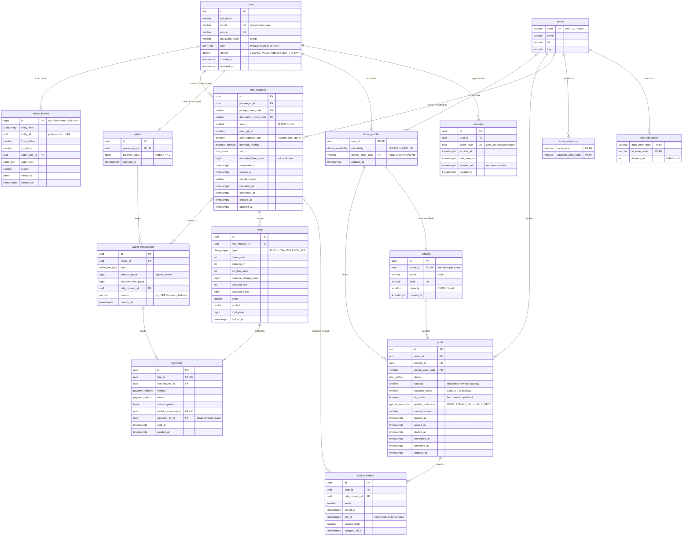

# ERD & Database Design — Dhaka Tesla Pool (MVP)

| Field | Value |
|---|---|
| Document ID | DTP-ERD-001 |
| Version | 1.0 |
| Author | Golam Mahadi Ahmed |
| Implements | [SRS §7 Data requirements](SRS.md#7-data-requirements), [Architecture §7](ARCHITECTURE.md#7-consistency--concurrency-strategy-nfr-con-0106-adr-0006) |
| DBMS / access | PostgreSQL 16 via Prisma ([ADR-0002](adr/0002-postgresql.md), [ADR-0004](adr/0004-prisma-with-hand-written-integrity-sql.md)) |

| Version | Date | Change |
|---|---|---|
| 0.1 | 2026-09-24 | Initial physical model: 15 tables, enums, constraints, indexes, worked data example, design rationale |
| 0.2 | 2026-09-24 | Same-gender ride option (SRS BR-18): `users.gender`, `ride_requests.same_gender_only`, `pools.gender_restriction`, new enums, CHECK constraint, invariant, seed genders |
| 0.3 | 2026-09-24 | Synced with the implemented schema: `wallet_transactions.reason` (records the SEED opening balance), `status_history.id` is an auto-increment bigint, migration file names |
| 0.4 | 2026-09-24 | `audit_entity` gains `PAYMENT` (migration `20260924140724_payment_audit_entity`); payment settlement rules as implemented |
| 1.0 | 2026-09-25 | Release baseline for v1.0.0; the schema and migrations match this document. No change to the model. |

---

## 1. Entity-relationship diagram



**Reading the diagram.** A passenger (`users`) creates `ride_requests`. A driver's `pools` row is one Tesla trip. `pool_members` is the explicit link between requests and pools (FR-POOL-10). `fares` records what was charged and why, `payments` records how it was settled, and `wallet_transactions` is the TeslaPay ledger. `status_history` records every lifecycle change.

## 2. Enumerations (PostgreSQL `ENUM` types, mirrored in `packages/shared`)

| Enum | Values | Used by |
|---|---|---|
| `user_role` | `PASSENGER`, `DRIVER` | users.role |
| `gender` | `FEMALE`, `MALE`, `PREFER_NOT_TO_SAY` | users.gender (default `PREFER_NOT_TO_SAY`) |
| `gender_restriction` | `NONE`, `FEMALE_ONLY`, `MALE_ONLY` | pools.gender_restriction (default `NONE`, BR-18) |
| `driver_availability` | `ONLINE`, `OFFLINE` | driver_profiles.availability |
| `ride_status` | `REQUESTED`, `MATCHED`, `DRIVER_ARRIVED`, `STARTED`, `COMPLETED`, `CANCELLED`, `EXPIRED` | ride_requests.status (SRS §5.1) |
| `pool_status` | `OPEN`, `DRIVER_ARRIVED`, `STARTED`, `COMPLETED`, `CANCELLED` | pools.status (SRS §5.2) |
| `payment_method` | `CASH`, `TESLAPAY` | ride_requests.payment_method, payments.method |
| `payment_status` | `PENDING_CASH`, `PAID`, `UNPAID` | payments.status |
| `charge_type` | `RIDE`, `CANCELLATION_FEE` | fares.type |
| `wallet_txn_type` | `TOPUP`, `RIDE_PAYMENT`, `CANCELLATION_FEE` | wallet_transactions.type |
| `audit_entity` | `RIDE_REQUEST`, `POOL`, `DRIVER`, `PAYMENT` | status_history.entity_type |
| `actor_role` | `PASSENGER`, `DRIVER`, `SYSTEM` | status_history.actor_role |

Reason codes are stored as varchar so that adding one needs no migration: `cancel_reason` and `status_history.reason` take values such as `PASSENGER_CANCELLED`, `NO_SHOW`, `DRIVER_CANCELLED_POOL`, `ALL_MEMBERS_CANCELLED`, `EXPIRED`, `LAST_MEMBER_DROPPED_OFF`, `SEED`.

## 3. Table dictionary (why each table exists)

| Table | Purpose | Key design notes | SRS |
|---|---|---|---|
| **users** | One row per person; the role decides which app they see | E-mail is normalized to lower case before insert, so the unique index is effectively case-insensitive. Each person has a single role (A-06). `gender` is optional, self-declared and used only for matching; it is never exposed to other passengers (A-19, A-20). | FR-AUTH-01…04, FR-PAX-11 |
| **sessions** | Server-side sessions for cookie auth | Only a **hash** of the token is stored, so a DB leak doesn't reveal usable cookies. `revoked_at` makes logout real (FR-AUTH-03). `ON DELETE CASCADE` from users. | FR-AUTH-02/03, NFR-SEC-06 |
| **driver_profiles** | Driver-only state: availability and current zone | Exists only for drivers, so `vehicles` and `pools` reference it rather than `users`, and a passenger can never own a Tesla or a pool, structurally. **This row is the first lock** in every driver command (Architecture §7). CHECK: ONLINE ⇒ zone set. | FR-DRV-02/03 |
| **vehicles** | The Tesla and its fixed capacity | `UNIQUE(driver_id)` enforces one Tesla per driver (A-03). Capacity is 1–6. | FR-DRV-01 |
| **zones** | Fixed Dhaka areas | A natural key (`code` = `BAN`) keeps rows readable when inspecting data, and the codes never change. Lat/long are informational only. | FR-PAX-01, BR-08 |
| **zone_distances** | Distance table used for fares | Both directions are stored, so lookups need no `LEAST/GREATEST`. The seed asserts symmetry. Distances are integer metres. | BR-09 |
| **zone_adjacency** | Neighbour list used by matching | Symmetric pairs are stored explicitly (A-01, BR-08). | BR-02 |
| **ride_requests** | One passenger's trip request and its lifecycle | `estimated_fare_paisa` = the solo estimate at request time. `requested_at` and `expires_at` are reset when a driver cancels a pool and the ride returns to REQUESTED (RT-07). Partial unique index: one active ride per passenger. `same_gender_only` records the passenger's co-rider preference. | FR-PAX-*, §5.1 |
| **pools** | One Tesla trip: driver, vehicle, pickup zone, seats | `capacity` is **copied from the vehicle** at creation, so that `CHECK (occupied_seats <= capacity)` can live on the same row; a CHECK cannot read another table. `occupied_seats` is a maintained counter, updated only under the pool row lock. Partial unique index: one active pool per driver. `gender_restriction` is maintained under the pool row lock and recalculated when a member leaves (BR-18, FR-POOL-12). | FR-POOL-*, §5.2 |
| **pool_members** | Which ride is in which pool, and with how many seats | Not a `pool_id` column on `ride_requests`, because a ride can leave one pool (driver cancels) and join another. Membership also has its own facts: seats, joined/left, drop-off order. Partial unique index: at most one *active* membership per ride (FR-POOL-09). | FR-POOL-09/10 |
| **fares** | What was charged and why | The rate snapshot (base, per-km, bps, distance, seats, pooled) makes every fare re-computable by hand, forever (FR-FARE-03). `UNIQUE(ride_request_id, type)` allows one ride fare and at most one cancellation fee. For a fee row, the breakdown columns are 0 and `total_paisa` is the fee. | FR-FARE-*, BR-10…13 |
| **payments** | How a charge was settled | One payment per charge (`fare_id` unique), written in the same transaction as the drop-off or the cancellation. A ride fare is `TESLAPAY · PAID` (with its ledger entry) or `CASH · PENDING_CASH`; `method` can differ from the ride's chosen method, because TeslaPay falls back to cash when the balance is short (A-14). A cancellation fee is `TESLAPAY · PAID`, or `UNPAID` for cash rides and short balances (FR-PAY-05). `collected_by_id` records the driver who took the cash. | FR-PAY-03…05, BR-15/16 |
| **wallets** | TeslaPay balance per passenger | `CHECK (balance_paisa >= 0)`. The balance is updated with a guarded `UPDATE … WHERE balance_paisa >= amount`. | FR-PAY-01, FR-PAY-06 |
| **wallet_transactions** | Append-only ledger | A signed amount (the sign is checked against the type), plus `balance_after_paisa` for easy audit. Invariant: **Σ amount = wallet balance**. The seed balance is itself a `TOPUP` row with `reason = 'SEED'` (the nullable `reason` column describes non-ride entries). | FR-PAY-02…06, NFR-CON-05 |
| **status_history** | Audit trail for every lifecycle change | Polymorphic (`entity_type` + `entity_id`) so that rides, pools, driver availability and payments share one timeline format, which means there is no FK on `entity_id`. `bigint identity` gives a total order even for same-millisecond events. An **append-only trigger** blocks UPDATE and DELETE. | FR-HIST-01…04 |

### Column conventions

- **IDs.** UUIDs (`gen_random_uuid()`) for business rows. They are not guessable, which is defence in depth for authorization but never a substitute for it. `status_history` uses an auto-increment `bigint` instead.
- **Money.** `bigint`, in paisa, with a `_paisa` suffix in every column name (BR-14, D-05). Prisma maps these to JS `bigint`. Repositories convert them to `number` at the boundary, which is safe because every realistic amount is below 2^53.
- **Time.** `timestamptz(3)`, stored in UTC and displayed in Asia/Dhaka (A-16).
- **Foreign keys.** `ON DELETE RESTRICT` everywhere, because ride, fare, payment and audit data is never hard-deleted (SRS §7). The one exception is `sessions → users CASCADE`.
- **Prisma mapping.** Models are PascalCase and singular (`RideRequest`), mapped to snake_case plural tables with `@@map("ride_requests")`, and fields are camelCase with `@map("snake_case")`.

## 4. Integrity constraints — where each one lives

Prisma's schema language can express PKs, FKs, unique and regular indexes. It **cannot** express CHECK constraints, partial unique indexes or triggers. Those are added by hand to the generated migration (`prisma migrate dev --create-only`, then edit `migration.sql`) and are listed here so that they stay visible ([ADR-0004](adr/0004-prisma-with-hand-written-integrity-sql.md)).

### 4.1 Declared in `schema.prisma`

| Constraint | Table |
|---|---|
| All primary and foreign keys (with `onDelete: Restrict`, except sessions `Cascade`) | all |
| `UNIQUE (email)`, `UNIQUE (phone)` | users |
| `UNIQUE (token_hash)` | sessions |
| `UNIQUE (driver_id)`, `UNIQUE (plate)` | vehicles |
| `UNIQUE (passenger_id)` | wallets |
| `UNIQUE (pool_id, ride_request_id)` | pool_members |
| `UNIQUE (ride_request_id, type)` | fares |
| `UNIQUE (fare_id)`, `UNIQUE (wallet_transaction_id)` | payments |
| Composite PKs `(from_zone_code, to_zone_code)`, `(zone_code, adjacent_zone_code)` | zone_distances, zone_adjacency |

### 4.2 Hand-written SQL migration (`…_integrity_constraints/migration.sql`)

Implemented in `apps/api/prisma/migrations/20260923232901_integrity_constraints/migration.sql`; the schema itself is `20260923232834_init`, and `20260924140724_payment_audit_entity` adds `PAYMENT` to `audit_entity`.

```sql
-- CHECK constraints -----------------------------------------------------------
ALTER TABLE vehicles        ADD CONSTRAINT vehicles_capacity_check        CHECK (capacity BETWEEN 1 AND 6);
ALTER TABLE driver_profiles ADD CONSTRAINT driver_profiles_online_zone_check
                                CHECK (availability = 'OFFLINE' OR current_zone_code IS NOT NULL);
ALTER TABLE zone_distances  ADD CONSTRAINT zone_distances_valid_check     CHECK (from_zone_code <> to_zone_code AND distance_m > 0);
ALTER TABLE zone_adjacency  ADD CONSTRAINT zone_adjacency_no_self_check   CHECK (zone_code <> adjacent_zone_code);

ALTER TABLE ride_requests
  ADD CONSTRAINT ride_requests_seats_check          CHECK (seats BETWEEN 1 AND 6),
  ADD CONSTRAINT ride_requests_distinct_zones_check CHECK (pickup_zone_code <> destination_zone_code),
  ADD CONSTRAINT ride_requests_estimate_check       CHECK (estimated_fare_paisa >= 0),
  ADD CONSTRAINT ride_requests_same_gender_check    CHECK (NOT same_gender_only OR pool_opt_in);                -- FR-PAX-11

ALTER TABLE pools
  ADD CONSTRAINT pools_capacity_check       CHECK (capacity BETWEEN 1 AND 6),
  ADD CONSTRAINT pools_occupied_seats_check CHECK (occupied_seats >= 0 AND occupied_seats <= capacity);  -- AD-1 last line of defence

ALTER TABLE pool_members ADD CONSTRAINT pool_members_seats_check CHECK (seats >= 1);

ALTER TABLE fares ADD CONSTRAINT fares_amounts_check CHECK (
  base_paisa >= 0 AND distance_m >= 0 AND per_km_paisa >= 0 AND distance_charge_paisa >= 0
  AND discount_bps BETWEEN 0 AND 10000 AND discount_paisa BETWEEN 0 AND distance_charge_paisa
  AND seats >= 1 AND total_paisa >= 0);

ALTER TABLE payments ADD CONSTRAINT payments_amount_check CHECK (amount_paisa > 0);
ALTER TABLE wallets  ADD CONSTRAINT wallets_balance_check CHECK (balance_paisa >= 0);
ALTER TABLE wallet_transactions
  ADD CONSTRAINT wallet_tx_sign_check CHECK ((type = 'TOPUP' AND amount_paisa > 0) OR (type <> 'TOPUP' AND amount_paisa < 0)),
  ADD CONSTRAINT wallet_tx_balance_after_check CHECK (balance_after_paisa >= 0);

-- Partial unique indexes (business invariants) ----------------------------------
CREATE UNIQUE INDEX ride_requests_one_active_per_passenger
  ON ride_requests (passenger_id) WHERE status IN ('REQUESTED','MATCHED','DRIVER_ARRIVED','STARTED');   -- BR-05
CREATE UNIQUE INDEX pools_one_active_per_driver
  ON pools (driver_id) WHERE status IN ('OPEN','DRIVER_ARRIVED','STARTED');                              -- BR-04
CREATE UNIQUE INDEX pool_members_one_active_membership
  ON pool_members (ride_request_id) WHERE left_at IS NULL;                                               -- FR-POOL-09

-- Partial performance indexes ------------------------------------------------------
CREATE INDEX ride_requests_open_feed ON ride_requests (pickup_zone_code, requested_at) WHERE status = 'REQUESTED';
CREATE INDEX ride_requests_expiry    ON ride_requests (expires_at)                    WHERE status = 'REQUESTED';

-- Append-only audit trail and ledger ------------------------------------------------
CREATE FUNCTION forbid_update_delete() RETURNS trigger LANGUAGE plpgsql AS $$
BEGIN
  RAISE EXCEPTION '% is append-only', TG_TABLE_NAME;
END $$;
CREATE TRIGGER status_history_append_only      BEFORE UPDATE OR DELETE ON status_history
  FOR EACH ROW EXECUTE FUNCTION forbid_update_delete();                                                  -- FR-HIST-02
CREATE TRIGGER wallet_transactions_append_only BEFORE UPDATE OR DELETE ON wallet_transactions
  FOR EACH ROW EXECUTE FUNCTION forbid_update_delete();                                                  -- NFR-CON-05
```

Test clean-up uses `TRUNCATE … CASCADE`, which does not fire row-level DELETE triggers, so the append-only guard does not get in the way of tests.

### 4.3 Invariants enforced by services (and verified by tests)

The database cannot express these cheaply, so services uphold them under the pool row lock and integration tests check them after every scenario.

| Invariant | Test |
|---|---|
| `pools.occupied_seats = Σ pool_members.seats` over members with `left_at IS NULL` whose ride is MATCHED, DRIVER_ARRIVED or STARTED | TC-01, TC-06, TC-16 |
| All active members of a pool share `pools.pickup_zone_code`, and their destinations are pairwise same-or-adjacent (BR-02) | TC-20 |
| `pools.gender_restriction` = `<G>_ONLY` iff some active member has `same_gender_only` and gender G; then every active member has gender G (BR-18) | TC-47, TC-48 |
| The ride's status is consistent with the pool's status (e.g. pool STARTED ⇒ members STARTED or COMPLETED) | TC-25 |
| `wallets.balance_paisa = Σ wallet_transactions.amount_paisa` | TC-26 |
| Exactly one `status_history` row per transition | TC-30 |
| `vehicles` and `pools` reference only driver users, structurally via `driver_profiles` | TC-37 (seed) |

## 5. Indexes (NFR-PERF-02)

| Index | Serves |
|---|---|
| `users (email)` UK, `users (phone)` UK | Login lookup |
| `sessions (token_hash)` UK · `sessions (user_id)` | Session middleware · logout of all sessions |
| `ride_requests_open_feed (pickup_zone_code, requested_at) WHERE status = 'REQUESTED'` | Driver's relevant-request feed (FR-DRV-04) |
| `ride_requests_expiry (expires_at) WHERE status = 'REQUESTED'` | Expiry sweeper |
| `ride_requests (passenger_id, created_at DESC)` | Passenger history (FR-PAX-09) |
| `ride_requests_one_active_per_passenger` (partial UK) | Active-ride lookup and BR-05 |
| `pools (driver_id, created_at DESC)` | Driver history (FR-DRV-13) |
| `pools_one_active_per_driver` (partial UK) | Active-pool lookup and BR-04 |
| `pool_members (pool_id, ride_request_id)` UK · `pool_members (ride_request_id)` | Pool roster · the ride's pool |
| `fares (ride_request_id, type)` UK · `payments (ride_request_id)` | Fare / payment by ride |
| `wallet_transactions (wallet_id, created_at DESC)` | Wallet statement |
| `status_history (entity_type, entity_id, created_at)` | Ride and pool timelines (FR-PAX-10) |

## 6. Seed data (reference personas, DR-15)

| Table | Rows |
|---|---|
| zones / zone_distances / zone_adjacency | 10 zones, 90 directed distances, 24 directed adjacency pairs (SRS §13.3) |
| users | **Nusrat** (FEMALE), **Rafiq** (MALE), **Shirin** (FEMALE) as PASSENGER. **Jashim**, **Kamal** (MALE) as DRIVER. All use `SEED_DEMO_PASSWORD`. |
| driver_profiles | Jashim OFFLINE, Kamal OFFLINE |
| vehicles | **Bullet** (Jashim, `DHAKA-TESLA-11`, 3 seats) · **Toofan** (Kamal, `DHAKA-TESLA-22`, 3 seats) |
| wallets + wallet_transactions | Nusrat ৳500.00 · Rafiq ৳0.00 (pays cash) · Shirin ৳200.00. Each non-zero balance is one `TOPUP` row, reason SEED. |

The seed uses upserts keyed on natural keys (e-mail, zone code, plate), so running it twice changes nothing (NFR-POR-03).

## 7. Worked data example — pooled ride (SRS scenario E1)

State of the database after the driver (Jashim) has dropped off both passengers (Nusrat, Rafiq) and collected the cash payment. The complete ride can be reconstructed from these rows alone (FR-HIST-04).

**ride_requests**

| id | passenger | pickup → destination | seats | pool_opt_in | payment_method | status | estimated_fare_paisa |
|---|---|---|---|---|---|---|---|
| r-nus | Nusrat | BAN → MHK | 1 | true | TESLAPAY | COMPLETED | 7500 |
| r-raf | Rafiq | BAN → GL1 | 1 | true | CASH | COMPLETED | 6750 |

**pools** — `p-1` · driver Jashim · vehicle Bullet · pickup BAN · status COMPLETED · capacity 3 · occupied_seats 0 (both dropped off) · is_private false · gender_restriction NONE

**pool_members**

| pool | ride | seats | left_at | dropoff_order |
|---|---|---|---|---|
| p-1 | r-nus | 1 | null | 1 |
| p-1 | r-raf | 1 | null | 2 |

**fares**

| ride | type | base | distance_m | per_km | distance_charge | discount_bps | discount | seats | pooled | total_paisa |
|---|---|---|---|---|---|---|---|---|---|---|
| r-nus | RIDE | 3000 | 3000 | 1500 | 4500 | 2000 | 900 | 1 | true | **6600** |
| r-raf | RIDE | 3000 | 2500 | 1500 | 3750 | 2000 | 750 | 1 | true | **6000** |

**payments** — r-nus: TESLAPAY · PAID · 6600 · wallet_transaction w-2 · r-raf: CASH · PAID · 6000 · collected_by Jashim

**wallet_transactions** (Nusrat) — w-1 TOPUP +50000 → balance_after 50000 (SEED) · w-2 RIDE_PAYMENT −6600 → balance_after 43400

**status_history** (excerpt, ordered by id)

| entity | from → to | actor | reason |
|---|---|---|---|
| RIDE_REQUEST r-nus | — → REQUESTED | Nusrat (PASSENGER) | |
| RIDE_REQUEST r-raf | — → REQUESTED | Rafiq (PASSENGER) | |
| POOL p-1 | — → OPEN | Jashim (DRIVER) | |
| RIDE_REQUEST r-nus | REQUESTED → MATCHED | Jashim (DRIVER) | |
| RIDE_REQUEST r-raf | REQUESTED → MATCHED | Jashim (DRIVER) | |
| POOL p-1 | OPEN → DRIVER_ARRIVED | Jashim (DRIVER) | |
| RIDE_REQUEST r-nus, r-raf | MATCHED → DRIVER_ARRIVED | Jashim (DRIVER) | |
| POOL p-1 | DRIVER_ARRIVED → STARTED | Jashim (DRIVER) | metadata: `{ "pooled": true }` |
| RIDE_REQUEST r-nus, r-raf | DRIVER_ARRIVED → STARTED | Jashim (DRIVER) | |
| RIDE_REQUEST r-nus | STARTED → COMPLETED | Jashim (DRIVER) | |
| RIDE_REQUEST r-raf | STARTED → COMPLETED | Jashim (DRIVER) | |
| POOL p-1 | STARTED → COMPLETED | SYSTEM | LAST_MEMBER_DROPPED_OFF |

## 8. Design rationale

| Design choice | Alternative considered | Rationale |
|---|---|---|
| `pools.occupied_seats` is a maintained counter | Computing `SUM(pool_members.seats)` on demand | The CHECK constraint can guard capacity on a single row, and one row lock serializes seat claims. The counter is changed only under that lock and is reconciled against the membership sum by integration tests (§4.3). |
| `pools.capacity` is copied from the vehicle | A trigger reading `vehicles.capacity` | A CHECK constraint cannot reference another table. The snapshot also records the capacity that applied to that trip. |
| A `pool_members` link table | A `ride_requests.pool_id` column | A ride can be re-matched to another pool after a driver cancels, and membership has its own attributes (seats, left_at, drop-off order). The partial unique index guarantees at most one active pool per ride. |
| Money in integer paisa (`bigint`) | `DECIMAL(10,2)` | Exact integer arithmetic in both TypeScript and SQL, with no floating-point rounding, and the fare formula maps one-to-one onto columns (D-05). |
| A rate snapshot stored on every fare | Recomputing from current rates | Rates may change. A locked fare must remain reproducible from its own row (FR-FARE-03). |
| A polymorphic `status_history` without an FK on `entity_id` | One history table per entity | One uniform timeline format for rides, pools and drivers. Integrity comes from writing the row in the same transaction as the change, and the trigger makes it immutable. |
| A separate `driver_profiles` table | Nullable driver columns on `users` | Keeps driver-only state out of passenger rows, gives driver commands a natural row to lock, and makes "only drivers own vehicles and pools" a structural property. |
| Capacity protection in the schema | Application checks only | `pools_occupied_seats_check` backs up the pool row lock and the ride compare-and-set, so a defect in application code cannot overbook a vehicle ([Architecture §7](ARCHITECTURE.md#7-consistency--concurrency-strategy-nfr-con-0106-adr-0006)). |
