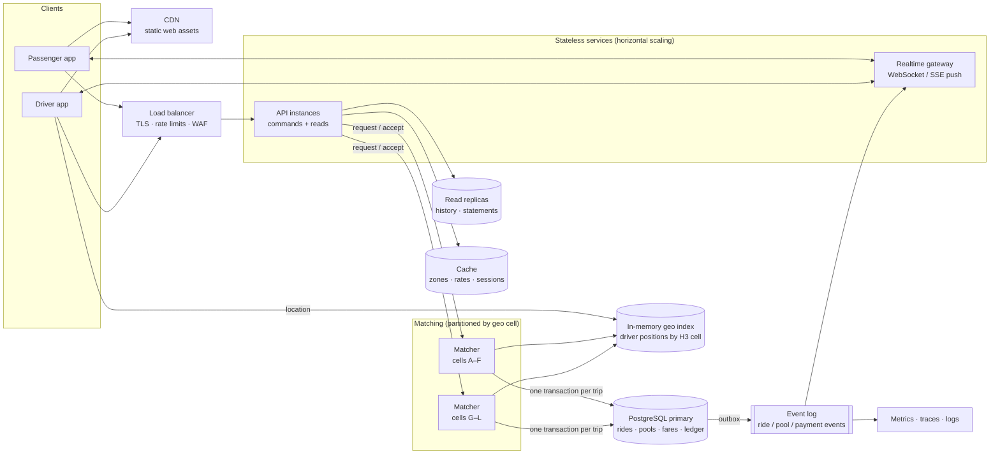

# Scaling Notes — "If Oi Tesla Goes Viral"

| Field | Value |
|---|---|
| Document ID | DTP-SCL-001 |
| Version | 1.0 |
| Scope | Design direction for 1M passengers and 100k drivers. Not implemented in the MVP. |
| Related | [Architecture](ARCHITECTURE.md) §7.4 · [ADR-0006](adr/0006-concurrency-row-locks-cas-constraints.md) · [SRS](SRS.md) §13.5 |

## 1. Purpose

The MVP is one web app, one API and one PostgreSQL database (ADR-0001). That is the right size for its load, and every rule that matters is enforced in one ACID transaction. This document records what would have to change if the product grew to a city-wide service, what would stay the same, and in which order the changes would be made. Each step is taken only when a measured limit is reached, not in advance.

## 2. Load estimate

The figures are deliberately rough; they set the order of magnitude that drives each decision.

| Quantity | Assumption | Result |
|---|---|---|
| Registered passengers | given | 1,000,000 |
| Registered drivers | given | 100,000 |
| Rides per day | 30 % of passengers ride once a day | ~300,000 |
| Peak ride requests | 15 % of a day's rides in the busiest hour | ~45,000 / h ≈ **13 / s** |
| Drivers online at peak | 40 % | ~40,000 |
| Live passenger screens at peak | active rides at any moment | ~20,000 |
| Status polling at today's 4 s interval | (20,000 + 40,000) / 4 s | **~15,000 req / s** |
| Driver location updates (once GPS is added) | 40,000 drivers every 5 s | **~8,000 writes / s** |

**What this shows.** The business writes (13 requests and a few dozen accepts per second) are small, and PostgreSQL handles them easily. Almost all the load is reads for live status and, later, location updates. So the design keeps the transactional core and moves the high-volume, low-value traffic away from it.

## 3. Target architecture

## 4. Decisions by topic

### 4.1 Load balancing and horizontal scaling
- The API is already stateless apart from two in-memory items: the sign-in rate-limit counters and the zone cache. Moving those to a shared cache makes every instance interchangeable.
- A load balancer in front of the API spreads traffic across instances and terminates TLS. Instances scale on CPU and request latency.
- The web app's static assets are served from a CDN, so page loads never reach the API.

### 4.2 Database: indexing, read replicas and contention
- **Indexes.** The MVP already indexes every list and lookup path (ERD §5). At scale, `status_history` and `wallet_transactions` become the largest tables; they are partitioned by month so that old partitions can be archived.
- **Read replicas.** Ride history, driver history and wallet statements tolerate a second of lag, so they move to replicas. Commands and a passenger's current ride stay on the primary, because they must read their own writes.
- **Contention.** Contention in this domain is local: it is the rows of one trip. Row locks stay correct at any scale; what grows is the number of concurrent lock waits on hot trips at busy pickups. Section 4.5 removes that by giving each trip a single writer.
- **Connections.** A connection pooler (PgBouncer) sits between many API instances and the primary. Transactions stay short, which the MVP already requires (no network calls inside, 3 s lock timeout).

### 4.3 Caching
- Zones, adjacency and fare rates change only with a deployment, so they are cached in every instance and in a shared cache, with the version in the key.
- Sessions are looked up on every request; a short-lived cache in front of the sessions table removes most of those reads. Revocation deletes the cache entry, so sign-out still takes effect immediately.
- Ride and trip state is **not** cached for commands. It is read from the primary inside the transaction, because a stale seat count is exactly the bug the design exists to prevent.

### 4.4 Geospatial search
- Fixed zones are replaced by H3 hexagonal cells (or PostGIS for storage and reporting). A request and a driver are indexed by cell, and "nearby" becomes "same cell or neighbouring ring".
- The compatibility rule keeps its shape: *same pickup cell, destinations within a detour budget, join window, seats, same-gender rule*. Only the adjacency test changes from a table lookup to a detour calculation from a routing service.
- Driver positions (8,000 writes per second) live in an in-memory geo index, not in PostgreSQL. Only trip-relevant positions (arrival, drop-off) are persisted.

### 4.5 Ride matching
- Matching is partitioned by pickup cell. Each partition has **one matcher**, so all decisions about one trip are made by one process, one at a time. This is the single-writer principle; it replaces lock contention with ordering.
- The matcher still commits each accept in one PostgreSQL transaction with the same CHECK constraints and partial unique indexes as today. The database remains the final guarantee: if two matchers ever disagreed, the constraint would refuse the second write.
- Automatic dispatch (offer a request to the best nearby driver, time out, offer to the next) replaces the manual feed, which does not scale to 40,000 online drivers.

### 4.6 Queues and events
- Every committed change writes an event to an **outbox** table in the same transaction; a relay publishes it to an event log. This keeps "the database changed" and "the event was sent" consistent without a distributed transaction.
- Consumers of the event log: the realtime gateway (push to phones), notifications, analytics, and fraud checks. None of them is on the path of a command, so a slow consumer never slows a ride.
- The request-expiry sweep, which today runs in every API instance, becomes one scheduled job.

### 4.7 Real-time communication
- Polling (15,000 requests per second at peak) is replaced by push: a WebSocket or SSE gateway subscribes to trip events and sends each passenger only their own ride's changes.
- Polling remains as a fallback when the connection drops, at a slower interval, so the app still works on poor mobile networks.

### 4.8 Idempotency and retries
- Every command (request ride, accept, arrive, start, drop off, top up) takes an **idempotency key** from the client. The first result is stored with the key, and a retry returns the same result instead of acting twice. This matters most for payments and accepts on flaky mobile networks.
- Retries are only automatic for failures that are safe to retry: lock timeouts (503), connection resets, and the matcher's own queue. Business refusals (409, 422) are never retried.
- Retries use exponential back-off with jitter, and a circuit breaker stops calling a failing dependency (routing, payments) while it recovers.

### 4.9 Rate limiting
- Rate limits move from per-instance memory to the load balancer and a shared store, and are keyed by user as well as IP.
- Limits differ by route: sign-in and sign-up are strict (credential stuffing), ride requests are limited per passenger (one active ride is already a rule), and read endpoints get a generous budget.

### 4.10 Observability
- The MVP already logs JSON with a request id and records every transition. At scale this becomes: metrics (request rate, error rate, latency per endpoint, lock waits, matcher queue depth), distributed traces across API, matcher and database, and log sampling for high-volume reads.
- Service-level objectives are set on what users feel: time to match, p95 command latency, and push delivery delay. Alerts fire on those, not on raw CPU.

### 4.11 Security
- The session design (httpOnly cookie, hashed tokens, server-side revocation) stays. Native mobile apps use the same sessions with a secure device store instead of a cookie.
- A web application firewall at the load balancer filters abusive traffic before it reaches the API.
- Personal data (phone numbers, gender, location history) is minimised as it is today, encrypted at rest, and location history is kept only as long as needed for support and disputes.
- Secrets move to a managed secret store with rotation; payment integration follows the provider's PCI scope so that card data never touches the API.

### 4.12 Deployment strategy
- Containers are already the unit of deployment. At scale they run on a managed container platform with health checks, rolling deployments and automatic rollback on failing health checks.
- Database migrations follow expand-and-contract: add the new column or table, deploy code that writes both, backfill, switch reads, then remove the old one. No migration locks a hot table.
- New matching or pricing behaviour ships behind feature flags and is enabled one city area at a time.

## 5. What stays the same

- The two state machines and their transition tables.
- The fare formula, integer paisa, and fixing the fare at trip start.
- One transaction per business command, with the database constraints as the final guarantee.
- The rule that a passenger never sees another passenger's personal data.

## 6. Order of changes

Each step is triggered by a measurement, not by the calendar.

| Step | Trigger | Change |
|---|---|---|
| 1 | API CPU or latency high | More API instances behind a load balancer; shared cache for rate limits and reference data |
| 2 | Polling dominates traffic | Realtime push gateway fed by an outbox and event log |
| 3 | History queries slow the primary | Read replicas for history and statements; partition audit and ledger tables |
| 4 | Real locations needed | H3 cells, in-memory driver geo index, routing service for detours |
| 5 | Lock waits at busy pickups | Matching partitioned by cell with a single matcher per partition; automatic dispatch |
| 6 | Payment integration | Idempotency keys on every command; circuit breakers around external providers |
