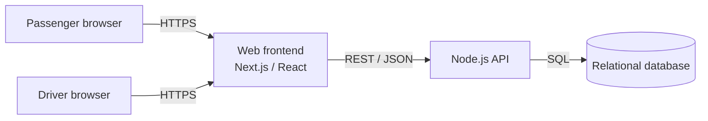
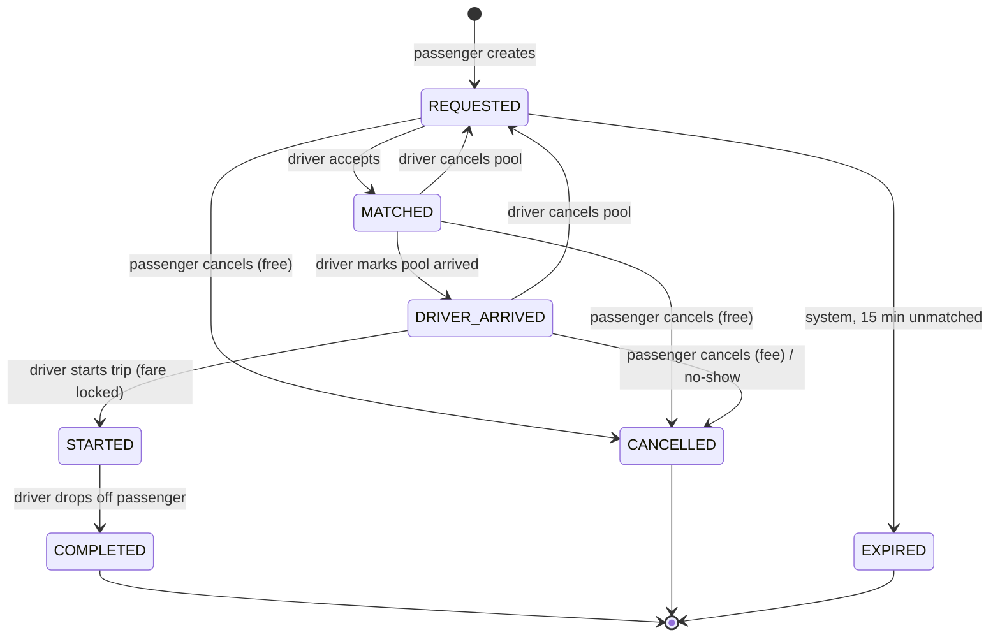
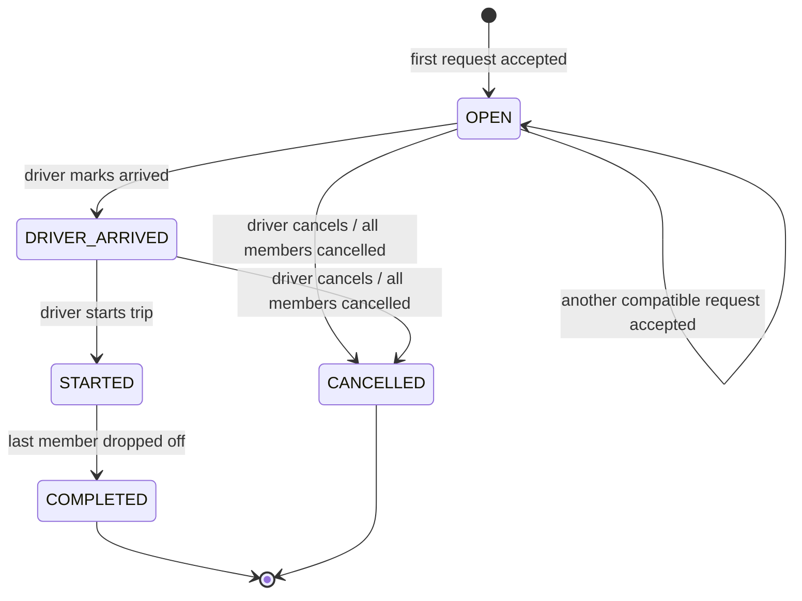

# Software Requirements Specification — Dhaka Tesla Pool (MVP)

> *Share a seat. Split the fare. Survive Dhaka traffic.*

| Field | Value |
|---|---|
| Document ID | DTP-SRS-001 |
| Standard | ISO/IEC/IEEE 29148:2018 — Software Requirements Specification (tailored for an MVP) |
| Product | Dhaka Tesla Pool — ride-pooling & shared-fare platform (MVP) |
| Source brief | *Dhaka Tesla Pool PRD — Internship Challenge* (RoBenDevs) — referenced as **PRD** |
| Version | 0.6 |
| Status | Baselined for release v1.0.0 |
| Author | Golam Mahadi Ahmed |
| Traceability workbook | [`DhakaPool_SRS_Tracker.xlsx`](DhakaPool_SRS_Tracker.xlsx) |

### Revision history

| Version | Date | Author | Change |
|---|---|---|---|
| 0.1 | 2026-09-23 | Golam Mahadi Ahmed | Initial draft: scope, functional/non-functional requirements, state machines, business rules, assumptions |
| 0.2 | 2026-09-24 | Golam Mahadi Ahmed | Aligned with the architecture phase: §7 data model synced to [ERD.md](ERD.md) (added `sessions`; `driver_status` renamed `driver_profiles`; zone code as key; capacity snapshot on pools). Decisions D-13…D-23 recorded with ADR links. Open issues OI-01…OI-03 resolved. |
| 0.3 | 2026-09-24 | Golam Mahadi Ahmed | Added the same-gender ride option: FR-AUTH-01 (optional gender), FR-PAX-11, FR-POOL-11/12, FR-DRV-06, BR-02 (f), BR-18, scenario E5, data model, UI, assumptions A-19…A-21, decision D-24. |
| 0.4 | 2026-09-24 | Golam Mahadi Ahmed | Decision D-25: neo-brutalist visual style for the web app (ADR-0013). No requirement changed. |
| 0.5 | 2026-09-25 | Golam Mahadi Ahmed | Baselined for release v1.0.0. No requirement changed. Implementation status and verification evidence for every requirement are in the traceability workbook; ADR-0001…0013 are Accepted. |
| 0.6 | 2026-09-28 | Golam Mahadi Ahmed | Added FR-AUTH-08: the sign-up form confirms the password and can reveal it. §8.1 sign-up screen updated. No API contract changed. |

---

## Table of contents

1. [Introduction](#1-introduction)
2. [References](#2-references)
3. [Overall description](#3-overall-description)
4. [Specific requirements — functional](#4-specific-requirements--functional)
5. [State machines](#5-state-machines)
6. [Business rules](#6-business-rules)
7. [Data requirements](#7-data-requirements)
8. [External interface requirements](#8-external-interface-requirements)
9. [Non-functional requirements](#9-non-functional-requirements)
10. [Design constraints](#10-design-constraints)
11. [Project delivery requirements](#11-project-delivery-requirements)
12. [Verification](#12-verification)
13. [Appendices](#13-appendices)

### Requirement conventions

- Every requirement has a unique, stable ID. IDs are never reused. If a requirement is removed, its row stays with status *Withdrawn*.
- Prefixes: `FR-<MODULE>-NN` for functional requirements, `BR-NN` for business rules, `NFR-<CATEGORY>-NN` for non-functional requirements, `DC-NN` for design constraints, `DR-NN` for delivery/process requirements, `A-NN` for assumptions, `D-NN` for decisions.
- **Priority (MoSCoW):** **M** = Must (MVP is not acceptable without it), **S** = Should, **C** = Could, **W** = Won't (this release).
- **"Shall"** marks a binding requirement, **"should"** a recommendation, and **"may"** an option.
- **PRD §** gives the section of the source brief each requirement traces to.
- The workbook (`DhakaPool_SRS_Tracker.xlsx`) is the living record of status, test mapping and branch/task mapping. This document is the source of truth for the requirement text.

---

## 1. Introduction

### 1.1 Purpose

This SRS defines what the Dhaka Tesla Pool MVP shall do and the quality attributes it shall have. It turns the product brief (PRD) into precise, numbered and testable requirements, and it records every assumption made where the PRD is intentionally vague (PRD §17). The intended readers are:

- the developer, who implements and tests against it;
- reviewers, who verify traceability from brief to requirement, test and code;
- anyone who later operates or extends the system.

### 1.2 Scope

**Dhaka Tesla Pool** is a web application in which **passengers** request rides between Dhaka zones and may share a three-wheeled battery "Tesla" with other passengers going a compatible way. **Drivers** go online, accept requests into a *pool*, and run the trip lifecycle. Each passenger pays an individual, transparent fare. The system keeps a complete, auditable history of every ride.

**In scope (MVP):**
- Passenger and driver accounts
- Zone-based ride requests with fare estimates
- Driver-accepted pooling with strict seat-capacity enforcement
- Per-passenger fares with a pool discount
- The ride and pool lifecycles, including cancellation rules
- Cash or simulated TeslaPay wallet payment
- Ride history and an audit trail
- Docker-based local run, and a free-tier deployment

**Out of scope (MVP):**
- Real road routing and turn-by-turn maps
- Live GPS tracking
- A real payment gateway
- Ratings and reviews
- An admin console
- Push notifications, SMS and e-mail
- Surge pricing
- Driver self-registration and KYC
- Multi-city support
- Native mobile apps

These are recorded as "W" items or as next improvements (§13.4).

**Benefits:** passengers pay less by sharing, drivers fill empty seats, and every fare and status change can be audited after the fact.

### 1.3 Product overview

#### 1.3.1 Product perspective

This is a new, self-contained system made of three runtime parts. There are no external service dependencies: no map API, no payment gateway and no message broker.

The detailed architecture ([ARCHITECTURE.md](ARCHITECTURE.md)) and ERD ([ERD.md](ERD.md)) are delivered separately (DR-06). They shall broadly match this context.

#### 1.3.2 Product functions (summary)

| Area | Summary |
|---|---|
| Accounts | Passenger sign-up/sign-in; driver sign-in (seeded); role-based access |
| Ride requests | Choose pickup and destination zone, seats, pool opt-in and payment method; see fare estimate; track status; cancel; history |
| Driver operations | Go online/offline in a zone; see relevant requests; accept into a pool; mark arrived, start, drop off each passenger; collect cash; history |
| Pooling | Compatible requests share one Tesla; seats never exceed capacity; pool membership is explicit |
| Fares & payment | Deterministic, hand-checkable fare in integer paisa; locked at trip start; cash or TeslaPay wallet |
| History & audit | Every status change recorded with actor, reason and timestamp |

#### 1.3.3 User classes and characteristics

| User class | Description | Technical skill | Frequency |
|---|---|---|---|
| **Passenger** | Commuter who wants a cheap, predictable ride and may share | Low–medium; mobile browser | Daily, short sessions |
| **Driver** | Owns and drives one Tesla with fixed capacity; wants to know who is riding and when to go | Low; mobile browser, one-handed use | Continuous during shifts |
| **Operator / Maintainer** | Deploys and runs the system via Docker, inspects data, runs tests | High | Occasional |

#### 1.3.4 Reference personas (seed and demo data)

The personas below come from the PRD's scenario (PRD §1) and are used consistently in seed data, tests, README and demo (PRD §18; DR-15).

| Person | Role | Detail |
|---|---|---|
| **Nusrat** | Passenger (female) | Banani → Mohakhali, 1 seat, opts in to pool, TeslaPay |
| **Rafiq** | Passenger (male) | Banani → Gulshan 1, 1 seat, opts in to pool, Cash |
| **Shirin** | Passenger (female) | Banani → Tejgaon, 1 seat, opts in to pool (the "last seat" contender); uses the same-gender option in scenario E5 |
| **Jashim** | Driver | Owns **Bullet** |
| **Bullet** | Tesla | 3 seats, plate `DHAKA-TESLA-11` (fictional) |
| **Kamal** | Driver (additional persona, A-15) | Owns **Toofan** (3 seats); used only to exercise two drivers accepting the same request (TC-06) |

#### 1.3.5 Limitations

- Geography is a fixed set of zones with a documented distance table, not real routing (PRD §4).
- Status updates reach clients by periodic polling, not push (D-11).
- The system is designed for a single database instance (see NFR-CON and §13.5 for the path to scale).

### 1.4 Definitions, acronyms and abbreviations

| Term | Definition |
|---|---|
| **Tesla** | Fictional name for a three-wheeled battery rickshaw. In the system it is a *vehicle* with a fixed seat capacity. |
| **Zone** | One of a predefined list of Dhaka areas (e.g. Banani, Mohakhali), with a code, a name and a representative lat/long. |
| **Ride request** | One passenger's request for a trip: pickup zone, destination zone, seats, pool opt-in and payment method. It has its own lifecycle (§5.1). |
| **Pool** | One trip of one Tesla, carrying one or more ride requests from the same pickup zone. It has its own lifecycle (§5.2). "Ride" and "pool" are used interchangeably from the driver's side. |
| **Pool member** | A ride request assigned to a pool. |
| **Occupied seats** | Sum of `seats` over a pool's members that are in an active status (MATCHED, DRIVER_ARRIVED, STARTED). |
| **Pooled** | A pool is *pooled* when two or more distinct ride requests (from different passengers) are on board at trip start. |
| **Paisa (poysha)** | 1/100 of a Bangladeshi Taka (৳). All money is stored as an integer number of paisa. |
| **TeslaPay** | Simulated in-app wallet. There is no real money and no real gateway. |
| **Active request** | A ride request in REQUESTED, MATCHED, DRIVER_ARRIVED or STARTED status. |
| **Active pool** | A pool in OPEN, DRIVER_ARRIVED or STARTED status. |
| **Audit trail** | Append-only log of status changes (`status_history`). |
| **Same-gender ride** | A pool restricted to co-riders of one declared gender (`FEMALE_ONLY` or `MALE_ONLY`) because at least one member requested it (BR-18). The driver is not part of the restriction. |
| MVP | Minimum Viable Product |
| RTM | Requirements Traceability Matrix |
| MoSCoW | Must / Should / Could / Won't prioritisation |

---

## 2. References

| Ref | Document |
|---|---|
| R1 | *Dhaka Tesla Pool — PRD, Internship Challenge*, RoBenDevs (file `Dhaka_Tesla_Pool_PRD_Internship.pdf`) |
| R2 | ISO/IEC/IEEE 29148:2018 — Systems and software engineering — Life cycle processes — Requirements engineering |
| R3 | Conventional Commits 1.0.0 (commit convention used by PRD §11) |
| R4 | OWASP Top 10 (2021) and OWASP API Security Top 10 (2023) — security baseline for NFR-SEC |
| R5 | `DhakaPool_SRS_Tracker.xlsx` — requirements traceability workbook (this repo) |
| R6 | [ARCHITECTURE.md](ARCHITECTURE.md) — DTP-ARC-001 architecture description |
| R7 | [ERD.md](ERD.md) — DTP-ERD-001 physical data model |
| R8 | [adr/](adr/README.md) — Architecture Decision Records 0001–0012 |

---

## 3. Overall description

### 3.1 Operating environment

| Item | Requirement |
|---|---|
| Clients | Current Chrome, Edge, Firefox and Safari (desktop and mobile). Minimum viewport width 360 px. |
| Server | Node.js LTS in a Linux container |
| Database | Relational DBMS in a container (PostgreSQL recommended, D-13) |
| Local run | Docker Engine with Docker Compose v2: `docker compose up` |
| Hosting | Free or free-tier only (PRD §6, §16) |

### 3.2 Assumptions and dependencies (summary)

The full register is in §13.1. The ones with the most impact:

- **A-01:** Geography is a fixed zone list with a documented distance table. No map API is used.
- **A-03:** One driver owns exactly one Tesla, and its capacity is fixed.
- **A-05:** Drivers are provisioned by seed data. There is no driver self-sign-up in the MVP.
- **A-08:** Arrival and start are pool-level events (all members share a pickup zone). Drop-off is per passenger.
- **A-11:** Clients refresh status by polling every 3–5 seconds.

---

## 4. Specific requirements — functional

### 4.1 Authentication & accounts (AUTH)

| ID | Requirement | Pri | PRD § | Acceptance criteria |
|---|---|---|---|---|
| FR-AUTH-01 | The system shall let a new passenger sign up with full name, phone number, e-mail, password and an optional self-declared gender (FEMALE, MALE or PREFER_NOT_TO_SAY; default PREFER_NOT_TO_SAY). | M | 3 | Valid input creates a PASSENGER account and a TeslaPay wallet with ৳0 balance. A duplicate e-mail or phone returns 409 and no account is created. A password shorter than 8 characters returns 400. |
| FR-AUTH-02 | The system shall let passengers and drivers sign in with e-mail (or phone) and password. | M | 3 | Correct credentials give an authenticated session that identifies the user and role. Wrong credentials return 401 with a generic message that does not reveal whether the account exists. |
| FR-AUTH-03 | The system shall let a signed-in user sign out, which invalidates the client session. | M | 3 | After sign-out, protected endpoints return 401 for that session. |
| FR-AUTH-04 | The system shall expose the current user's profile and role to the frontend. | M | 3 | `GET /me` returns id, name and role (plus the vehicle, for drivers). Without a session it returns 401. |
| FR-AUTH-05 | The frontend shall route users to the dashboard for their role and block access to the other role's pages. | M | 3 | A passenger who opens a driver URL is redirected or sees 403. The API enforces the same rule (NFR-SEC-03). |
| FR-AUTH-06 | Driver accounts, each linked to exactly one Tesla, shall be provisioned by seed data. | M | 3, 6 | After seeding, Jashim can sign in and sees Bullet (capacity 3). |
| FR-AUTH-07 | The system may allow driver self-registration with vehicle details. | W | 3 | Not in MVP (A-05). |
| FR-AUTH-08 | The sign-up form shall ask for the password twice and refuse to submit while the two entries differ, and shall let the user reveal or hide either entry. The confirmation is checked in the browser and is never sent to the API. | S | 6 | Differing entries show a field error and no request is made. Revealing one entry leaves the other hidden. The sign-up request carries the account fields only. |

### 4.2 Passenger ride requests (PAX)

| ID | Requirement | Pri | PRD § | Acceptance criteria |
|---|---|---|---|---|
| FR-PAX-01 | The system shall provide the list of supported zones for pickup and destination selection. | M | 4 | `GET /zones` returns every seeded zone with code, name and coordinates. The UI offers only these zones. |
| FR-PAX-02 | The system shall show a fare estimate for a pickup, destination and seat count before the passenger confirms. The estimate shall show both the solo fare and the "if pooled" fare. | M | 3, 5 | For Nusrat (Banani→Mohakhali, 1 seat), the estimate shows ৳75.00 solo and ৳66.00 if pooled, with the breakdown shown (BR-10). |
| FR-PAX-03 | A passenger shall be able to create a ride request with pickup zone, destination zone, seats (1 to the maximum vehicle capacity), pool opt-in (default: yes), same-gender co-riders only (default: no) and payment method (CASH or TESLAPAY). | M | 3 | Valid input creates a request in REQUESTED status and records an audit entry. Pickup equal to destination returns 400. Seats outside the valid range return 400. An unknown zone returns 400. |
| FR-PAX-04 | The system shall reject a new request while the passenger already has an active request. | M | 3, 12 | A second request returns 409 `ACTIVE_REQUEST_EXISTS`. This is enforced at database level as well (NFR-CON-04). |
| FR-PAX-05 | When TeslaPay is selected, the system shall reject the request if the wallet balance is lower than the estimated solo fare. | S | 5 | With a balance of ৳50 and a solo fare of ৳75, the request is rejected with 422 `INSUFFICIENT_BALANCE`. |
| FR-PAX-06 | The passenger shall be able to view their current ride: status, status timeline, pickup and destination, seats, fare (estimate or locked), payment method, driver name, Tesla name and plate once matched, whether the ride is shared, and the number of co-riders. | M | 2, 3 | Nusrat sees "Shared ride · 1 co-rider" and only her own fare. No other passenger's name, fare or destination appears anywhere in her API responses (A-09). |
| FR-PAX-07 | The passenger's ride view shall refresh status automatically without a manual page reload. | M | 3 | A status change made by the driver appears for the passenger within 5 s (polling, A-11). |
| FR-PAX-08 | A passenger shall be able to cancel their own request when the cancellation rules allow it (BR-07). If a fee applies, the fee shall be shown and confirmed before cancelling. | M | 3, 12 | Cancelling in REQUESTED or MATCHED is free. Cancelling in DRIVER_ARRIVED shows "৳20.00 cancellation fee" and requires confirmation. Cancelling in STARTED, COMPLETED, CANCELLED or EXPIRED returns 409 `INVALID_STATE_TRANSITION`. |
| FR-PAX-09 | The passenger shall be able to view their ride history (newest first, paginated), showing date, route, seats, final status, final fare, payment method and whether the ride was shared. | M | 3 | The history contains only the passenger's own requests. An empty history shows an empty state. |
| FR-PAX-10 | The passenger shall be able to open a past ride and see its full status timeline and fare breakdown. | S | 2, 3 | The timeline lists every transition with its timestamp, taken from the audit trail. |
| FR-PAX-11 | A passenger whose declared gender is FEMALE or MALE may request a same-gender ride (co-riders of their gender only). The option shall be unavailable to passengers who declared PREFER_NOT_TO_SAY, and it requires pool opt-in. The ride view shall show a "Women-only ride" / "Men-only ride" badge. | S | 2, 3 | Shirin (FEMALE) can set the option. A PREFER_NOT_TO_SAY passenger setting it gets 400 `VALIDATION_ERROR`, as does setting it with pool opt-in = false. No co-rider gender is ever returned by passenger APIs. |

### 4.3 Driver & Tesla operations (DRV)

| ID | Requirement | Pri | PRD § | Acceptance criteria |
|---|---|---|---|---|
| FR-DRV-01 | A signed-in driver shall see their Tesla's name, plate and seat capacity. | M | 3 | Jashim sees "Bullet · DHAKA-TESLA-11 · 3 seats". |
| FR-DRV-02 | A driver shall be able to go online, selecting their current zone, and go offline. | M | 3 | Going online sets the driver ONLINE in the chosen zone. Going offline sets OFFLINE. Both are audited. |
| FR-DRV-03 | The system shall prevent a driver from going offline while they have an active pool. | M | 3 | Returns 409 `ACTIVE_POOL_EXISTS`. The UI disables the toggle and explains why. |
| FR-DRV-04 | An online driver shall see relevant requests. With no active pool, these are REQUESTED, non-expired requests whose pickup zone is the driver's current zone and whose seats are at most the vehicle capacity. With an OPEN pool, these are only requests compatible with that pool (BR-02). Each shows pickup, destination, seats, pool opt-in, estimated fare and age. | M | 3, 4 | With Jashim online in Banani and Nusrat's request pending, the list contains Nusrat. After accepting Nusrat, it contains Rafiq (compatible) and does not contain a Banani→Uttara request. An offline driver gets 409 `DRIVER_OFFLINE`. |
| FR-DRV-05 | A driver shall be able to accept a relevant request. If the driver has no active pool, a new pool is created. If the driver has an OPEN pool, the request is added to it. | M | 3 | The request moves to MATCHED and becomes a pool member, and occupied seats go up by its seat count, all in one transaction. The server re-checks every rule (BR-01…BR-05) at accept time. A rule violation returns 409 or 422 with a specific code. |
| FR-DRV-06 | The driver shall see the active pool: status, occupied and free seats, and for each member the passenger's name, pickup, destination, seats, status, payment method and fare, plus a badge when the pool is gender-restricted. | M | 2, 3 | With Nusrat and Rafiq matched, Jashim sees "2 / 3 seats occupied" and both members with their fares. |
| FR-DRV-07 | The driver shall be able to mark the pool as arrived at the pickup zone. | M | 3 | The pool moves OPEN→DRIVER_ARRIVED, and every MATCHED member moves to DRIVER_ARRIVED. |
| FR-DRV-08 | The driver shall be able to start the trip. | M | 3 | The pool moves DRIVER_ARRIVED→STARTED, and every DRIVER_ARRIVED member moves to STARTED. Fares are locked (BR-12). Starting is rejected if the pool has no member in DRIVER_ARRIVED. |
| FR-DRV-09 | The driver shall be able to drop off (complete) each passenger individually, in any order. | M | 3 | The member moves STARTED→COMPLETED and payment is settled (BR-15/BR-16). When the last member is completed, the pool automatically becomes COMPLETED and the driver's current zone is set to the last drop-off zone. |
| FR-DRV-10 | For cash payments, the driver shall be able to mark cash as collected. | M | 5 | The payment status for that member becomes PAID with method CASH. This action is audited. |
| FR-DRV-11 | The driver shall be able to cancel the pool before the trip starts. | M | 3 | The pool moves to CANCELLED. Active members move back to REQUESTED so another driver can pick them up, and passengers are not charged. Cancelling after STARTED returns 409. |
| FR-DRV-12 | The driver shall be able to mark an arrived passenger as a no-show after a 5-minute wait. | C | 3 | The member moves DRIVER_ARRIVED→CANCELLED with reason NO_SHOW, and the ৳20 fee applies (BR-07). |
| FR-DRV-13 | The driver shall see their ride history: past pools with date, route(s), members, final status and total fare per pool. | M | 3 | The history contains only the driver's own pools. |

### 4.4 Pooling & capacity (POOL)

| ID | Requirement | Pri | PRD § | Acceptance criteria |
|---|---|---|---|---|
| FR-POOL-01 | A pool shall be created on the driver's first acceptance and linked to exactly one driver and one vehicle, with status OPEN. | M | 3 | The pool row references driver and vehicle, and its creation is audited. |
| FR-POOL-02 | The occupied seats of a pool shall never exceed its vehicle's capacity, under any sequence or concurrency of operations. | M | 3, 12 | Accepting a request that needs more seats than are free returns 409 `CAPACITY_EXCEEDED`. The concurrency test in NFR-CON-01 passes. |
| FR-POOL-03 | Compatibility (BR-02) shall be enforced on the server at accept time, not only by filtering the request list. | M | 4 | A crafted accept call for an incompatible request returns 422 `NOT_COMPATIBLE`. |
| FR-POOL-04 | A request with pool opt-in = false shall form a private pool that no other request can join. A request with opt-in = false cannot join an existing pool. | M | 2 | Accepting a second request into a private pool returns 422 `NOT_COMPATIBLE`. |
| FR-POOL-05 | New members may join a pool only while the pool is OPEN. | M | 3 | Accepting into a DRIVER_ARRIVED or STARTED pool returns 409 `POOL_NOT_OPEN`. |
| FR-POOL-06 | A member's cancellation shall free their seats immediately. | M | 3 | After Rafiq cancels in MATCHED, occupied seats drop from 2 to 1, and Shirin becomes acceptable. |
| FR-POOL-07 | If a pool has no active members before it starts, it shall be cancelled automatically, freeing the driver. | M | 3 | When Nusrat, the only member, cancels, the pool becomes CANCELLED with reason ALL_MEMBERS_CANCELLED. |
| FR-POOL-08 | A pool shall be completed automatically when its last on-board member is completed. | M | 3 | The pool status is COMPLETED and `completed_at` is set. |
| FR-POOL-09 | A ride request shall belong to at most one active pool at a time. | M | 3 | Enforced by a unique constraint. Two drivers accepting the same request concurrently gives exactly one success; the other gets 409 `INVALID_STATE_TRANSITION`. |
| FR-POOL-10 | Pool membership shall be explicit and queryable. For any pool it shall be possible to list its members and each member's seats and status. | M | 3 | The driver's pool view and the database both show the membership. |
| FR-POOL-11 | Gender restrictions (BR-18) shall be enforced on the server at accept time, under the same pool lock as capacity. | S | 2, 4 | With Shirin (same-gender option) in Bullet's pool, accepting Rafiq returns 422 `NOT_COMPATIBLE` with reason `GENDER_RESTRICTED`, and accepting Nusrat succeeds. Accepting a same-gender request from Shirin into a pool containing Rafiq returns the same 422. |
| FR-POOL-12 | A pool's gender restriction shall be recalculated whenever a member leaves before the trip starts. | S | 3 | If Shirin was the only member requesting it and she cancels, the restriction returns to NONE and Rafiq becomes acceptable. |

### 4.5 Fares (FARE)

| ID | Requirement | Pri | PRD § | Acceptance criteria |
|---|---|---|---|---|
| FR-FARE-01 | The system shall calculate each passenger's fare with the formula in BR-10, using the zone distance table (BR-09). | M | 5 | The worked examples in §6.4 are reproduced exactly by unit tests. |
| FR-FARE-02 | At request time, the system shall store and show an estimate: the solo fare, plus the pooled fare if the passenger opted in. | M | 5 | The request record stores `estimated_fare_paisa` (solo). The response includes both figures. |
| FR-FARE-03 | At trip start, the system shall lock each on-board member's final fare and store the rates used (base, per-km, discount rate, distance, seats, pooled flag). | M | 2, 5 | Changing the rate configuration afterwards does not change any locked fare. |
| FR-FARE-04 | The passenger and driver views shall show a fare breakdown: base, distance charge, pool discount, seats and total. | M | 5 | The numbers in the breakdown add up to the total shown. |
| FR-FARE-05 | A cancellation fee (BR-07) shall be recorded as its own charge linked to the request. | M | 5 | Rafiq cancelling after arrival creates a 2000-paisa CANCELLATION_FEE charge. |
| FR-FARE-06 | All monetary values shall be stored and calculated as integer paisa. They are formatted as ৳ with two decimals only for display. | M | 5 | There are no floating-point money columns in the schema. 6600 is displayed as "৳66.00". |

### 4.6 Payments & TeslaPay wallet (PAY)

| ID | Requirement | Pri | PRD § | Acceptance criteria |
|---|---|---|---|---|
| FR-PAY-01 | Every passenger shall have one TeslaPay wallet. The passenger can see its balance and transaction list. | M | 5 | Nusrat's seeded balance is visible, and her transactions are listed newest first. |
| FR-PAY-02 | The passenger shall be able to add simulated funds (top-up) of ৳50–৳5,000 per operation. | S | 5 | A top-up of ৳500 increases the balance by 50000 paisa and creates a TOPUP ledger entry. Out-of-range amounts return 400. The UI labels this clearly as simulated money. |
| FR-PAY-03 | For TESLAPAY rides, completing the member shall debit the locked fare from the wallet atomically and create a RIDE_PAYMENT ledger entry. | M | 5 | The balance goes down by exactly the locked fare. Payment status becomes PAID. |
| FR-PAY-04 | For CASH rides, completing the member shall set payment status to PENDING_CASH until the driver marks it collected (FR-DRV-10). | M | 5 | Rafiq's payment status shows "Cash due ৳60.00" and then "Paid (cash)". |
| FR-PAY-05 | A cancellation fee shall be debited from the wallet for TESLAPAY requests. For CASH requests it shall be recorded as UNPAID. | S | 5 | The wallet ledger or charge record reflects the fee. Collecting unpaid cash fees is out of scope (§13.4). |
| FR-PAY-06 | A wallet balance shall never go negative. Every balance change shall have exactly one ledger entry. | M | 5, 6 | A DB CHECK (balance ≥ 0) exists. The sum of ledger entries equals the balance for every seeded and test wallet. |

### 4.7 History & audit (HIST)

| ID | Requirement | Pri | PRD § | Acceptance criteria |
|---|---|---|---|---|
| FR-HIST-01 | Every status change of a ride request, pool or driver availability shall be recorded with entity, from-status, to-status, actor (user id and role, or SYSTEM), reason and timestamp. | M | 2, 6 | Each transition in §5 creates exactly one audit row, in the same transaction as the change. |
| FR-HIST-02 | Audit records shall be append-only. The application shall provide no update or delete path for them. | M | 2 | There is no endpoint or service method that modifies audit rows. |
| FR-HIST-03 | Rejected transition attempts shall be logged (in application logs, not the audit table) with the actor and the reason. | S | 6 | An invalid "start" call produces a WARN log entry with the request id. |
| FR-HIST-04 | A completed or cancelled ride shall keep enough data to explain later who rode, in which Tesla, with how many seats, when each status changed, what was charged and why, and how it was paid. | M | 2 | An operator can reconstruct the complete Nusrat and Rafiq ride (scenario E1) from database records alone. |

---

## 5. State machines

The PRD suggests a single lifecycle (REQUESTED → MATCHED/ACCEPTED → DRIVER_ARRIVED → STARTED → COMPLETED, plus CANCELLED). **Improvement (D-12):** the lifecycle is split into two linked state machines, because a pooled trip has passenger-level events and trip-level events that do not line up. Nusrat is dropped off at Mohakhali and is COMPLETED while Rafiq is still riding to Gulshan 1. One status field could not show both facts truthfully.

Transitions are exposed as explicit commands (e.g. `POST /pools/:id/start`), not as a free-form "set status" endpoint. Each command validates the current state and the actor, and performs the transition atomically. Any transition not listed below is rejected with **409 `INVALID_STATE_TRANSITION`** and has no side effects (BR-06).

### 5.1 Ride request (per passenger)

| # | From | To | Actor | Guard(s) | Side effects |
|---|---|---|---|---|---|
| RT-01 | — | REQUESTED | Passenger (owner) | FR-PAX-03 validation; no active request (BR-05) | Estimate stored; audit |
| RT-02 | REQUESTED | MATCHED | Driver | Driver ONLINE; request not expired; BR-01…BR-04 | Pool created or joined; seats claimed; audit |
| RT-03 | REQUESTED | CANCELLED | Passenger (owner) | — | Audit (free) |
| RT-04 | REQUESTED | EXPIRED | System | 15 min in REQUESTED (A-13) | Audit |
| RT-05 | MATCHED | DRIVER_ARRIVED | Driver (pool owner) | Cascade of PT-02 | Audit |
| RT-06 | MATCHED | CANCELLED | Passenger (owner) | — | Seats freed; maybe auto-cancel pool (FR-POOL-07); audit (free) |
| RT-07 | MATCHED | REQUESTED | Driver (pool owner) | Cascade of PT-04 | Membership ended; seats freed; expiry timer restarts; audit |
| RT-08 | DRIVER_ARRIVED | STARTED | Driver (pool owner) | Cascade of PT-03 | Fare locked (BR-12); audit |
| RT-09 | DRIVER_ARRIVED | CANCELLED | Passenger (owner) **or** Driver (no-show, ≥5 min, C) | — | ৳20 fee (BR-07); seats freed; audit |
| RT-10 | DRIVER_ARRIVED | REQUESTED | Driver (pool owner) | Cascade of PT-04 | As RT-07, no fee |
| RT-11 | STARTED | COMPLETED | Driver (pool owner) | Member belongs to driver's STARTED pool | Payment settlement (BR-15/16); maybe auto-complete pool; audit |

Terminal states are **COMPLETED, CANCELLED and EXPIRED**. A terminal request never changes again.

### 5.2 Pool (per Tesla trip)

| # | From | To | Actor | Guard(s) | Side effects |
|---|---|---|---|---|---|
| PT-01 | — / OPEN | OPEN | Driver | Driver has no other active pool (BR-04); request compatible (BR-02); seats free (BR-01) | Member added |
| PT-02 | OPEN | DRIVER_ARRIVED | Driver (owner) | ≥1 member MATCHED | All MATCHED members → DRIVER_ARRIVED |
| PT-03 | DRIVER_ARRIVED | STARTED | Driver (owner) | ≥1 member DRIVER_ARRIVED | All DRIVER_ARRIVED members → STARTED; fares locked |
| PT-04 | OPEN / DRIVER_ARRIVED | CANCELLED | Driver (owner) | — | Active members → REQUESTED (RT-07/RT-10) |
| PT-05 | OPEN / DRIVER_ARRIVED | CANCELLED | System | Active member count reaches 0 | Driver freed (reason ALL_MEMBERS_CANCELLED) |
| PT-06 | STARTED | COMPLETED | System | Every on-board member COMPLETED | Driver's zone := last drop-off zone |

### 5.3 Driver availability

`OFFLINE ⇄ ONLINE`. Going OFFLINE is rejected while the driver has an active pool (FR-DRV-03). Accepting requests requires ONLINE.

---

## 6. Business rules

### 6.1 Geography & matching

| ID | Rule | PRD § |
|---|---|---|
| BR-01 | **Capacity.** A request may be accepted into a pool only if `occupied_seats + request.seats ≤ vehicle.capacity`. The database enforces this as well (NFR-CON-01). | 3, 12 |
| BR-02 | **Compatibility (matching rule).** A REQUESTED request *R* may join an OPEN pool *P* only if **all** of the following hold: (a) `R.pickup_zone = P.pickup_zone`; (b) R and every active member of P opted in to pooling; (c) for every active member *M* of P, `R.destination = M.destination` **or** the two destinations are adjacent zones (BR-08); (d) R was created no more than **10 minutes** after P was created; (e) BR-01 holds; (f) the gender rule BR-18 holds. | 4 |
| BR-03 | **Solo pools.** The first request accepted by a driver always creates a new pool, provided its seats ≤ capacity. If that request did not opt in to pooling, the pool is private (FR-POOL-04). | 3 |
| BR-04 | **One active pool per driver.** A driver may have at most one active pool. | 3 |
| BR-05 | **One active request per passenger.** A passenger may have at most one active request. | 3 |
| BR-06 | **Closed state machines.** Only the transitions in §5 are allowed, and only by the listed actor. All others are rejected without side effects. | 3, 12 |
| BR-08 | **Zones.** The zone list, the distance table and the adjacency list are fixed reference data (seeded, §13.3). Distances are symmetric road-approximation values in kilometres, stored as integer metres. Adjacency is symmetric and declared explicitly; it is not derived from distance. | 4 |
| BR-18 | **Same-gender rides.** Let *G(x)* be a passenger's declared gender. A pool's restriction is `FEMALE_ONLY` or `MALE_ONLY` if any active member requested a same-gender ride, and `NONE` otherwise. Request *R* may join pool *P* only if: (a) when P is restricted, G(R) matches the restriction; and (b) when R requests a same-gender ride, every active member of P has gender G(R). Passengers with PREFER_NOT_TO_SAY can join only unrestricted pools. The driver's gender is not considered. The fare rules are unchanged (BR-10…12). | 2, 4 |

**Why this rule (D-03).** The PRD asks for a rule that handles Nusrat's and Rafiq's trips, which overlap but are not identical, and applies consistently. Requiring the same pickup zone keeps pickup to a single stop, so no pickup routing is needed. Requiring destinations to be the same or adjacent keeps the detour to one short hop between neighbouring zones. The 10-minute window stops a new rider joining a pool whose first passenger has already waited a long time. The rule is simple enough to verify by reading the adjacency table.

**BR-02 applied to the reference scenario (Banani pickup):**
- **Nusrat** (Banani→Mohakhali) is accepted first and creates pool P.
- **Rafiq** (Banani→Gulshan 1) joins P, because Mohakhali and Gulshan 1 are adjacent.
- **Shirin** (Banani→Tejgaon) is compatible with both, because Tejgaon is adjacent to Mohakhali and to Gulshan 1. She can take Bullet's third seat.
- A **Banani→Uttara** request is not compatible with P: Uttara is adjacent to neither destination.

**BR-18 applied (scenario E5):**
- **Shirin** (female, same-gender option) is accepted first. Bullet's pool becomes `FEMALE_ONLY`.
- **Nusrat** (female, no option) can join, because her destination is compatible and she is female.
- **Rafiq** (male) cannot join (`GENDER_RESTRICTED`), even though his route is compatible.
- If Rafiq had been accepted first, the pool would stay `NONE` (mixed). Nusrat could still join without the option, but a same-gender request from Shirin would be rejected.

**Why (D-24).** Some passengers, particularly women, are more willing to share a small vehicle with strangers of the same gender. Because the restriction is a pool property checked under the pool lock, it is race-free in the same way capacity is. Only co-riders are restricted: both MVP driver personas are male, and a driver rule would make restricted rides unmatchable.

### 6.2 Cancellation

| ID | Rule | PRD § |
|---|---|---|
| BR-07 | **Passenger cancellation.** In REQUESTED or MATCHED it is free. In DRIVER_ARRIVED it is allowed with a **৳20 (2000 paisa)** fee. In STARTED it is not allowed; the passenger is dropped off instead. After a terminal state it is not allowed. **Driver no-show cancellation** (C) is allowed ≥ 5 min after arrival and has the same fee. **Driver pool cancellation** is allowed only before STARTED, costs passengers nothing, and returns them to REQUESTED. | 3, 12 |

**Why (D-08).** Cancelling before the driver has arrived costs the driver very little, so it is free. After arrival the driver has spent the trip, so a small fee discourages no-shows. Once the ride has started the passenger is already on board, so "cancel" really means "drop me off".

### 6.3 Fares

| ID | Rule | PRD § |
|---|---|---|
| BR-09 | **Distance.** `distance_m` is the zone-to-zone table value for the request's pickup and destination (e.g. Banani→Mohakhali = 3000 m). Each passenger is charged for their own pickup→destination distance, not for any detour. | 4, 5 |
| BR-10 | **Formula (per seat).** `distanceCharge = roundHalfUp(distance_m × PER_KM_PAISA / 1000)`; `poolDiscount = pooled ? roundHalfUp(distanceCharge × POOL_DISCOUNT_BPS / 10000) : 0`; `farePerSeat = BASE_FARE_PAISA + distanceCharge − poolDiscount`; `passengerFare = farePerSeat × seats`. | 5 |
| BR-11 | **Rates (MVP defaults, configurable).** `BASE_FARE_PAISA = 3000` (৳30), `PER_KM_PAISA = 1500` (৳15/km), `POOL_DISCOUNT_BPS = 2000` (20 % of the distance charge), `CANCELLATION_FEE_PAISA = 2000` (৳20). The base fare is never discounted. | 5 |
| BR-12 | **Locking.** The estimate is shown at request time. The final fare is fixed at **trip start**. `pooled = true` only if **two or more distinct passengers' requests** move to STARTED together in that pool. One passenger booking two seats does not count as pooling. The fare and the rates used are stored immutably. | 5 |
| BR-13 | **Rounding.** Half-up to a whole paisa, applied only where BR-10 says. With the default rates and whole-100 m distances, every result is exact. | 5 |
| BR-14 | **Money storage.** Integer paisa in 64-bit integer columns. There is no floating point anywhere in money logic (D-05). | 5 |

**Why (D-06/D-07).**
- The discount applies only to the distance part. That keeps the base fare, which covers the driver's fixed cost per pickup, intact, and it makes the discount grow with trip length, which is where sharing saves the most.
- Locking at start means the discount is given only when the Tesla really was shared. If Rafiq cancels before start, Nusrat did not share and pays the solo fare. After start the price can no longer change under her.
- Integer paisa avoids binary floating-point errors (0.1 + 0.2 ≠ 0.3) and makes the arithmetic exact and easy to check by hand.

### 6.4 Worked fare examples (hand-verifiable — PRD §5)

Rates: base 3000, per km 1500, discount 20 % of the distance charge.

| Passenger | Route | Distance | Distance charge | Solo fare | Pool discount | **Pooled fare** |
|---|---|---|---|---|---|---|
| Nusrat | Banani → Mohakhali | 3.0 km (3000 m) | 3000 × 1500 / 1000 = **4500** | 3000 + 4500 = **7500** (৳75.00) | 4500 × 20 % = **900** | 3000 + 4500 − 900 = **6600** (৳66.00) |
| Rafiq | Banani → Gulshan 1 | 2.5 km (2500 m) | 2500 × 1500 / 1000 = **3750** | 3000 + 3750 = **6750** (৳67.50) | 3750 × 20 % = **750** | 3000 + 3750 − 750 = **6000** (৳60.00) |
| Shirin | Banani → Tejgaon | 5.0 km (5000 m) | **7500** | **10500** (৳105.00) | **1500** | **9000** (৳90.00) |

**Scenarios:**
- **E1: Nusrat and Rafiq share Bullet.** Both are on board at start, so the ride is pooled. Nusrat pays ৳66.00 via TeslaPay and Rafiq pays ৳60.00 in cash. The two riders together save ৳16.50.
- **E2: Rafiq cancels in MATCHED.** He is not charged. At start Nusrat is alone, so she is not pooled and pays ৳75.00.
- **E3: Rafiq cancels in DRIVER_ARRIVED.** He is charged the ৳20.00 fee. Nusrat is alone at start and pays ৳75.00.
- **E4: Nusrat books 2 seats solo.** She pays 7500 × 2 = 15000 (৳150.00). This is not pooled, because the two seats belong to one passenger.

### 6.5 Payment

| ID | Rule | PRD § |
|---|---|---|
| BR-15 | **TeslaPay settlement.** When a member is completed, the locked fare is debited in the same transaction as the COMPLETED transition. If the balance is insufficient at that moment (A-14), the payment status becomes PENDING_CASH and the driver collects cash. | 5 |
| BR-16 | **Cash settlement.** The payment is PENDING_CASH on completion and becomes PAID when the driver marks it collected. | 5 |
| BR-17 | **Top-up.** Simulated only, ৳50–৳5,000 per operation, credited immediately. | 5 |

---

## 7. Data requirements

This section is the conceptual data model. The physical model, with column types, constraint names, indexes and a worked data example, is in **[ERD.md](ERD.md)** (DR-06). Every entity below shall exist in some form, and every listed constraint shall be enforced **by the database**, not only in application code.

| Entity | Key attributes | Integrity constraints |
|---|---|---|
| **users** | id, full_name, email, phone, password_hash, role (PASSENGER / DRIVER), gender (FEMALE / MALE / PREFER_NOT_TO_SAY), created_at | email and phone unique; role and gender enums; password stored only as a hash; gender used only for matching |
| **sessions** | id, user_id, token_hash, expires_at, last_seen_at, revoked_at | token_hash unique; only the SHA-256 of the cookie token is stored (ADR-0005) |
| **driver_profiles** | user_id, availability (ONLINE / OFFLINE), current_zone_code, updated_at | exists only for drivers; ONLINE ⇒ current zone set (CHECK); the row locked first by driver commands |
| **vehicles** (Teslas) | id, driver_id → driver_profiles, name, plate, capacity | exactly one vehicle per driver (unique driver_id); capacity 1–6 (CHECK); plate unique |
| **zones** | code (PK, e.g. BAN), name, lat, lng | natural key |
| **zone_distances** | from_zone_code, to_zone_code, distance_m | PK (from, to); from ≠ to; distance_m > 0; both directions stored |
| **zone_adjacency** | zone_code, adjacent_zone_code | PK pair; symmetric; no self-pairs |
| **ride_requests** | id, passenger_id, pickup_zone_code, destination_zone_code, seats, pool_opt_in, same_gender_only, payment_method, status, estimated_fare_paisa, requested_at, expires_at, cancel_reason, timestamps | pickup ≠ destination; seats 1–6; same_gender_only ⇒ pool_opt_in (CHECK); status enum; **at most one active request per passenger** (partial unique index) |
| **pools** | id, driver_id → driver_profiles, vehicle_id, pickup_zone_code, status, capacity (snapshot of the vehicle's), occupied_seats, is_private, gender_restriction (NONE / FEMALE_ONLY / MALE_ONLY), lifecycle timestamps | **0 ≤ occupied_seats ≤ capacity** (CHECK on the same row); **at most one active pool per driver** (partial unique index); status enum |
| **pool_members** | pool_id, ride_request_id, seats, joined_at, left_at, dropoff_order, dropped_off_at | FK both; unique (pool, ride); **a request is in at most one active pool** (partial unique index on left_at IS NULL) |
| **fares** | ride_request_id, type (RIDE / CANCELLATION_FEE), base_paisa, distance_m, per_km_paisa, distance_charge_paisa, discount_bps, discount_paisa, seats, pooled, total_paisa, locked_at | all amounts ≥ 0; discount ≤ distance charge; unique (ride, type); immutable after lock |
| **payments** | id, fare_id, ride_request_id, method (CASH / TESLAPAY), status (PENDING_CASH / PAID / UNPAID), amount_paisa, wallet_transaction_id, collected_by_id, paid_at | amount > 0; one payment per fare |
| **wallets** | id, passenger_id, balance_paisa | one per passenger; **balance ≥ 0** (CHECK) |
| **wallet_transactions** | id, wallet_id, type (TOPUP / RIDE_PAYMENT / CANCELLATION_FEE), amount_paisa (signed), balance_after_paisa, ride_request_id?, created_at | sign matches type (CHECK); **append-only** (trigger); sum of entries = balance |
| **status_history** | id (bigint identity), entity_type (RIDE_REQUEST / POOL / DRIVER), entity_id, from_status, to_status, actor_user_id?, actor_role (PASSENGER / DRIVER / SYSTEM), reason, metadata, created_at | **append-only** (trigger); indexed by (entity_type, entity_id, created_at) |

**Indexes required** (NFR-PERF-02; full list in [ERD §5](ERD.md#5-indexes-nfr-perf-02)):
- `ride_requests (pickup_zone_code, requested_at) WHERE status = 'REQUESTED'` for the driver's request feed
- `ride_requests (expires_at) WHERE status = 'REQUESTED'` for the expiry sweeper
- `ride_requests (passenger_id, created_at desc)` for passenger history
- `pools (driver_id, created_at desc)` for driver history
- `status_history (entity_type, entity_id, created_at)` for timelines

**Retention:** ride, fare, payment and audit data is kept indefinitely in the MVP. Nothing is hard-deleted.

---

## 8. External interface requirements

### 8.1 User interfaces

| Screen | Role | Must show / allow | States |
|---|---|---|---|
| Sign up | Passenger | Name, phone, e-mail, password and its confirmation, each able to be revealed (FR-AUTH-08), optional gender (noting it is used only for matching); field errors | submitting, error |
| Sign in | Both | E-mail/phone, password; demo credentials hint in non-production | submitting, error |
| Request a ride | Passenger | Pickup and destination zone selectors, seats, "Share my ride" toggle, "Same-gender co-riders only" toggle (shown only when a gender is declared), payment method, live estimate (solo and pooled) | loading zones, estimating, error, disabled while an active ride exists |
| Current ride | Passenger | Status stepper or timeline, driver and Tesla, shared indicator and co-rider count, fare (estimate or locked, with breakdown), cancel button with fee warning | loading, no active ride (empty), error, polling |
| Ride history & detail | Passenger | List plus a detail page with timeline and breakdown | loading, empty, error |
| Wallet | Passenger | Balance, transactions, simulated top-up | loading, empty, error |
| Driver dashboard | Driver | Tesla card, Online/Offline toggle with zone, seats occupied/free | loading, error |
| Requests | Driver | Relevant requests with Accept; auto-refresh | loading, empty ("No requests in Banani right now"), error, offline notice |
| Active pool | Driver | Members (name, destination, seats, status, fare, payment), buttons for Arrived / Start / Drop off / Cash collected / Cancel pool, shown only when valid | loading, empty, error |
| Driver history | Driver | Past pools with members and totals | loading, empty, error |

Every screen must meet NFR-USA-01…05.

### 8.2 Software interface — REST API (overview)

The API style is REST over JSON (D-10). State transitions are action sub-resources. The final contract is documented in the README API overview (DR-05).

| Method & path | Actor | Purpose | Req |
|---|---|---|---|
| `POST /api/auth/signup` · `POST /api/auth/login` · `POST /api/auth/logout` · `GET /api/auth/me` | Public / any | Accounts & session | FR-AUTH-01…04 |
| `GET /api/zones` | Any authenticated | Zone list | FR-PAX-01 |
| `POST /api/fares/estimate` | Passenger | Solo and pooled estimate | FR-PAX-02 |
| `POST /api/rides` · `GET /api/rides?scope=active\|history` · `GET /api/rides/:id` · `POST /api/rides/:id/cancel` | Passenger (owner) | Ride requests | FR-PAX-03…10 |
| `GET /api/wallet` · `GET /api/wallet/transactions` · `POST /api/wallet/topup` | Passenger | TeslaPay | FR-PAY-01…02 |
| `PUT /api/driver/availability` | Driver | Online/offline and zone | FR-DRV-02…03 |
| `GET /api/driver/requests` · `POST /api/driver/requests/:id/accept` | Driver | Relevant requests and accept | FR-DRV-04…05 |
| `GET /api/driver/pools?scope=active\|history` | Driver (owner) | Active pool and history | FR-DRV-06, 13 |
| `POST /api/pools/:id/arrive` · `/start` · `/cancel` | Driver (owner) | Pool transitions | FR-DRV-07, 08, 11 |
| `POST /api/pools/:id/members/:rideId/complete` · `/no-show` · `/cash-collected` | Driver (owner) | Member transitions and payment | FR-DRV-09, 10, 12 |
| `GET /health` | Public | Liveness and DB readiness | NFR-REL-02 |

**Error format (all endpoints):** `{ "error": { "code": "CAPACITY_EXCEEDED", "message": "Bullet has only 1 seat left", "details": {…} }, "requestId": "…" }`

| HTTP | Codes |
|---|---|
| 400 | `VALIDATION_ERROR` |
| 401 | `UNAUTHENTICATED` |
| 403 | `FORBIDDEN` |
| 404 | `NOT_FOUND` (also used for another user's resources, so that they are not revealed) |
| 409 | `INVALID_STATE_TRANSITION`, `CAPACITY_EXCEEDED`, `ACTIVE_REQUEST_EXISTS`, `ACTIVE_POOL_EXISTS`, `POOL_NOT_OPEN`, `DRIVER_OFFLINE`, `CONFLICT` |
| 422 | `NOT_COMPATIBLE`, `INSUFFICIENT_BALANCE` |
| 429 | `RATE_LIMITED` |
| 500 | `INTERNAL_ERROR` |
| 503 | `SERVICE_UNAVAILABLE` |

### 8.3 Hardware and communications interfaces

There are no hardware interfaces. All client–server traffic is HTTPS in the deployed environment (HTTP is acceptable on localhost).

---

## 9. Non-functional requirements

### 9.1 Security (SEC)

| ID | Requirement | Pri | PRD § | Acceptance criteria |
|---|---|---|---|---|
| NFR-SEC-01 | Passwords shall be stored only as salted, adaptive hashes (bcrypt cost ≥ 10 or argon2id). | M | 6 | No plaintext or reversible password exists in the database or logs. |
| NFR-SEC-02 | Every endpoint except sign-up, sign-in, zones (optional) and health shall require authentication. | M | 6 | Unauthenticated calls return 401. |
| NFR-SEC-03 | **Object-level authorization:** a passenger may read or change only their own requests and wallet. A driver may act only on their own pool and on requests shown to them as relevant. Role checks apply to every endpoint. | M | 2, 6, 12 | Rafiq cancelling Nusrat's ride returns 404/403 and nothing changes. Nusrat calling a driver endpoint returns 403. This is covered by automated tests. |
| NFR-SEC-04 | All input shall be validated against a schema at the API boundary (types, ranges, enums, unknown fields rejected). | M | 6 | Invalid payloads return 400 `VALIDATION_ERROR` with field details. |
| NFR-SEC-05 | Secrets shall come only from environment variables. `.env.example` has placeholders only, and no real secret is committed. | M | 6, 16 | The repository scan finds no secrets, and `.env` is git-ignored. |
| NFR-SEC-06 | Session tokens shall be protected: an httpOnly, SameSite cookie (Secure in production), or a short-lived bearer token. CORS is restricted to the frontend origin. Standard security headers are set. | M | 6 | Inspection of headers and cookie flags passes. |
| NFR-SEC-07 | Authentication endpoints shall be rate-limited per IP. | S | 12 | More than 10 login attempts per minute from one IP returns 429. |
| NFR-SEC-08 | Database access shall use parameterised queries or an ORM only. | M | 6 | No string-concatenated SQL appears in the code. |
| NFR-SEC-09 | Error responses shall not leak stack traces or internal details in production. | M | 6 | A 500 response contains only the code, a generic message and the requestId. |

### 9.2 Data consistency & concurrency (CON)

| ID | Requirement | Pri | PRD § | Acceptance criteria |
|---|---|---|---|---|
| NFR-CON-01 | **Last-seat race.** When Bullet has 1 free seat and two accept operations for different 1-seat requests (Nusrat's and Shirin's) run concurrently, exactly one shall succeed. The other returns 409 `CAPACITY_EXCEEDED`, and occupied seats never exceed capacity. | M | 12 | An automated test fires both accepts in parallel N times (N ≥ 20). Every run has exactly one success, and the DB CHECK is never violated. |
| NFR-CON-02 | Every state transition shall be an atomic compare-and-set on the current status (e.g. update … where status = expected), inside a DB transaction together with all its side effects (membership, seats, fare, payment, audit). | M | 6, 12 | A crash or error mid-operation leaves no partial state. Two concurrent transitions on the same entity give one success and one 409. |
| NFR-CON-03 | Seat claims shall be serialised per pool (row-level lock on the pool, or a conditional increment guarded by the capacity CHECK). The chosen mechanism shall be documented in the README together with what would change at larger scale. | M | 12 | The README section "Concurrency" exists and matches the code. |
| NFR-CON-04 | "One active request per passenger", "one active pool per driver" and "a request is in at most one active pool" shall be enforced by database constraints, in addition to service checks. | M | 6, 12 | Direct concurrent inserts cannot create duplicates. |
| NFR-CON-05 | Wallet debits and credits shall be atomic with their ledger entry. The balance can never go negative. | M | 5, 6 | Concurrent debit tests leave `balance = Σ ledger` and balance ≥ 0. |
| NFR-CON-06 | Request creation should be idempotent for client retries (an `Idempotency-Key` header, or reliance on NFR-CON-04). | C | 12 | A retried POST with the same key returns the original request. |

### 9.3 Reliability & availability (REL)

| ID | Requirement | Pri | PRD § | Acceptance criteria |
|---|---|---|---|---|
| NFR-REL-01 | All API errors shall use the standard error format (§8.2), with a correlation `requestId`. | M | 6 | Contract tests check the error shape. |
| NFR-REL-02 | `GET /health` shall report API liveness and DB connectivity. Docker health checks shall use it, and the database container shall have its own health check. | M | 6 | `docker compose ps` shows the services as *healthy*. The API starts only after the DB is healthy. |
| NFR-REL-03 | If the database is unreachable, the API shall return 503 and recover automatically when the DB returns, with no restart needed. | S | 6 | Manual test: stop the DB, call the API (503), start the DB, call the API (200). |
| NFR-REL-04 | Request expiry (RT-04) shall be applied reliably even if no scheduler has run: expired requests shall never be accepted and shall show as EXPIRED on read. | M | 3 | Accepting a request older than 15 min returns 409, whether or not the sweeper has run. |

### 9.4 Performance (PERF)

| ID | Requirement | Pri | PRD § | Acceptance criteria |
|---|---|---|---|---|
| NFR-PERF-01 | With seed-scale data on the local Docker setup, 95 % of API requests shall complete in under 300 ms. | S | 6 | A simple load script (e.g. 20 concurrent users for 1 min) meets p95 < 300 ms. |
| NFR-PERF-02 | The indexes listed in §7 shall exist, so that request lists, history and pool lookups do not need full table scans. | M | 6 | Migration inspection and `EXPLAIN` on key queries. |
| NFR-PERF-03 | The client polling interval shall be 3–5 s, and polling shall stop when a ride reaches a terminal state or the tab is hidden. | S | 3 | Inspection of network activity. |

### 9.5 Usability (USA)

| ID | Requirement | Pri | PRD § | Acceptance criteria |
|---|---|---|---|---|
| NFR-USA-01 | Every data-driven view shall have explicit loading, empty and error states, and an error state shall offer a retry. | M | 6 | Review of every screen in §8.1. |
| NFR-USA-02 | Statuses shall be shown with human-readable labels (e.g. STARTED = "On the way") and a progress stepper or timeline. | M | 3, 6 | Visual check. |
| NFR-USA-03 | Action buttons shall appear only when the transition is valid for the current state and role. The server remains authoritative (BR-06). | M | 3 | A driver in OPEN sees "Arrived" but not "Start". |
| NFR-USA-04 | Money shall be displayed as ৳ with exactly two decimals. The fare breakdown shall be one tap or click away. | M | 5 | "৳66.00" is shown for 6600 paisa. |
| NFR-USA-05 | The UI shall be usable on a 360 px-wide mobile viewport and via keyboard, with labelled form controls and sufficient contrast. | S | 6 | Manual check at mobile width; lint or axe shows no critical issues. |
| NFR-USA-06 | Destructive actions (cancel ride, cancel pool) shall ask for confirmation and state any fee. | M | 3 | Visual check. |

### 9.6 Portability & deployability (POR)

| ID | Requirement | Pri | PRD § | Acceptance criteria |
|---|---|---|---|---|
| NFR-POR-01 | `docker compose up`, run on a clean machine with only Docker installed, shall start the database, API and web app, apply migrations and load seed data, with no manual steps beyond copying `.env.example` to `.env`. | M | 6 | Tested from a fresh clone. The reference personas can sign in. |
| NFR-POR-02 | All configuration (DB URL, secrets, rates, CORS origin, ports) shall be via environment variables with documented defaults. | M | 6 | `.env.example` lists every variable. |
| NFR-POR-03 | Schema changes shall be made only through versioned, re-runnable migrations. Seeding shall be idempotent. | M | 6 | Running up twice causes no errors and creates no duplicate personas. |
| NFR-POR-04 | The system shall be deployed publicly on free tiers, or, if that is not possible, a reproducible Docker deployment shall be documented along with the constraint. | S | 6 | A URL is in the README, or a documented fallback. |

### 9.7 Observability (OBS)

| ID | Requirement | Pri | PRD § | Acceptance criteria |
|---|---|---|---|---|
| NFR-OBS-01 | The API shall write structured (JSON) logs with timestamp, level, requestId, user id (when present), method, route, status code and latency. | M | 6 | Log inspection. |
| NFR-OBS-02 | Every successful state transition shall be logged at INFO and every rejected one at WARN, including the error code. | S | 6 | Log inspection during tests. |
| NFR-OBS-03 | Logs shall never contain passwords, tokens or full session cookies. | M | 6 | Inspection. |

### 9.8 Maintainability (MNT)

| ID | Requirement | Pri | PRD § | Acceptance criteria |
|---|---|---|---|---|
| NFR-MNT-01 | Business rules (matching, capacity, transitions, fares, cancellation) shall live in a domain or service layer, not in route handlers or UI components. | M | 6 | Code review: controllers contain no rule logic. |
| NFR-MNT-02 | Fare calculation and transition validation shall be pure functions with unit tests. | M | 5, 12 | They are unit-tested with no DB. |
| NFR-MNT-03 | The codebase shall use TypeScript (or a documented alternative), a linter and a formatter, and follow a documented project structure. | S | 6 | CI or a local lint run passes. |
| NFR-MNT-04 | Automated tests shall run with one documented command, locally and in Docker. | M | 12 | The README states the command, and it passes. |

---

## 10. Design constraints

| ID | Constraint | PRD § |
|---|---|---|
| DC-01 | The frontend shall be **React or Next.js**. Next.js App Router is recommended. | 6 |
| DC-02 | The backend shall be **Node.js**. The framework choice (Express, NestJS, Fastify, …) shall be justified in the README. | 6, 7 |
| DC-03 | The database shall be **relational**, chosen and justified by the developer. PostgreSQL is recommended (D-13). | 6 |
| DC-04 | Only free or free-tier services shall be used. | 6, 16 |
| DC-05 | Microservices, Kafka, Kubernetes, Redis or queues shall not be introduced without a documented, concrete need. The MVP is one API, one web app and one DB. | 9 |
| DC-06 | No real map, routing or payment API is required. The system shall work fully offline from third-party services. | 4, 5 |
| DC-07 | For every non-mandated choice (DB, ORM, auth, styling, tests, hosting), the README shall state: the choice, the realistic alternatives, why it fits a ride-pooling MVP, and the conditions that would prompt a change. | 7 |

---

## 11. Project delivery requirements

These come from the PRD's process sections. They are scored explicitly (PRD §15) and are therefore traced like product requirements.

| ID | Requirement | Pri | PRD § | Acceptance criteria |
|---|---|---|---|---|
| DR-01 | The repository shall have long-lived branches **`master`**, **`pre-release`** and **`release/v1.0.0`**. | M | 10 | The branches exist on the remote. |
| DR-02 | Feature work shall be done on `feature/*` branches (e.g. `feature/passenger-auth`, `feature/tesla-pooling`, `feature/driver-flow`) and merged into `master` when working. Nothing shall be pushed directly to `master`. `pre-release` is cut after MVP integration; `release/v1.0.0` is cut from `pre-release`. | M | 10, 16 | The git graph shows merges from feature branches. |
| DR-03 | Commits shall follow `<type>(<scope>): <description>` with types feat, fix, refactor, test, docs, chore, build. Each commit is one logical change. There shall be no vague messages and no micro-commit spam. | M | 11 | Log review. |
| DR-04 | The history shall show incremental progress. There shall be no single giant commit containing the finished system. | M | 10, 16, 18 | Log review. |
| DR-05 | The README shall cover: summary, problem, features, screenshots or GIFs, architecture diagram, ERD, tech stack, structure, prerequisites, environment variables, local and Docker setup, migrations and seed, how to run the apps and tests, demo credentials, deployment URL, API overview, key decisions and trade-offs, known limitations, next improvements, AI usage, and the video link. | M | 12 | Checklist review. |
| DR-06 | An architecture diagram (at minimum Browser → Next.js/React → Node.js API → DB) and an ERD shall be provided and kept consistent with the implementation. | M | 9 | Diagrams exist in the repo and README and match the code. |
| DR-07 | The README shall justify every non-mandated technology choice (DC-07). | M | 7 | Review. |
| DR-08 | The README shall include an AI Usage section: which tools were used and for what, one accepted suggestion, and one rejected or changed suggestion with the reason. | M | 8 | Review. |
| DR-09 | The repo shall include Docker Compose, `.env.example`, migrations and seed data using the reference personas (§1.3.4). | M | 6, 14 | NFR-POR-01 passes. |
| DR-10 | Automated tests shall cover at least: (1) capacity is never exceeded; (2) invalid transitions are rejected; (3) Nusrat's and Rafiq's pooled fares are correct; (4) users cannot modify another user's ride; (5) cancellation rules hold; (6) concurrent requests cannot corrupt capacity. | M | 12 | Test IDs TC-01…TC-06 (and more) pass. |
| DR-11 | The system shall be deployed on free tiers with the URL in the README, or a documented reproducible Docker deployment and the constraint that prevented deployment. | S | 6, 14 | URL or documented fallback. |
| DR-12 | A video of at most 6 minutes shall be linked prominently in the README, following the PRD §13 structure (problem, engineering, product tour). | M | 13 | The link works and the video is ≤ 6:00. |
| DR-13 | No paid infrastructure shall be used, and no secrets committed. | M | 16 | Review. |
| DR-14 | No technology shall be added only to make the architecture look impressive. | M | 9, 16 | Every component in the diagram has a stated reason. |
| DR-15 | The reference personas (Nusrat, Rafiq, Shirin, Jashim, Bullet) shall be used consistently in seed data, tests, README and demo. There shall be no user1/driver1 placeholders. | M | 1, 16, 18 | Search the repo for "user1" or "driver1": no results. |
| DR-16 | The README shall document the concurrency approach now and what would change at scale. | M | 12 | Review (links to NFR-CON-03). |
| DR-17 | A "viral scale" section (1M passengers, 100k drivers) should reason about load balancing, horizontal scaling, indexing and read replicas, caching, geospatial search, queues and events, real-time delivery, rate limiting, idempotency, observability, DB contention, matching, retries, security and deployment, ideally with a diagram. | C | 12 | Section exists. |
| DR-18 | This SRS and its traceability workbook shall be kept up to date when requirements or architecture change. | S | 9 | The revision history is updated. |

---

## 12. Verification

Each requirement is verified by one of the following methods:
- **T (Test):** an automated unit, integration or end-to-end test.
- **D (Demonstration):** a manual walkthrough, recorded in the video or demo.
- **I (Inspection):** review of code, configuration, repository or documentation.

The workbook maps each requirement to its method and test case IDs.

| Group | Default method |
|---|---|
| FR-AUTH, FR-PAX, FR-DRV, FR-POOL, FR-FARE, FR-PAY, FR-HIST | T (integration), plus D for UI behaviour |
| BR-* | T (unit for pure rules, integration for DB-enforced rules) |
| NFR-SEC, NFR-CON | T, plus I |
| NFR-REL, NFR-PERF, NFR-POR | D, plus I (plus a load script for PERF-01) |
| NFR-USA, NFR-OBS, NFR-MNT | I, plus D |
| DC-*, DR-* | I |

**Key test cases.** The full list is in the workbook's *Test_Cases* sheet.

| Test | Covers | Summary |
|---|---|---|
| TC-01 | FR-POOL-02, BR-01 | Bullet with 3 occupied seats cannot accept a 1-seat request. A 2-seat request with only 1 seat free is rejected. |
| TC-02 | BR-06, §5 | Invalid transitions are rejected with 409 and leave no side effects (e.g. start an OPEN pool, complete a MATCHED member, cancel a STARTED ride). |
| TC-03 | FR-FARE-01, BR-10…12 | Nusrat is charged 6600 and Rafiq 6000 when pooled; 7500 and 6750 solo. |
| TC-04 | NFR-SEC-03 | Rafiq cannot view, cancel or modify Nusrat's ride. A passenger cannot call driver actions. Kamal cannot act on Jashim's pool. |
| TC-05 | BR-07, FR-PAX-08 | Cancellation is free in REQUESTED/MATCHED, costs ৳20 in DRIVER_ARRIVED, and is rejected in STARTED. |
| TC-06 | NFR-CON-01, FR-POOL-09 | Parallel accepts of Nusrat and Shirin for Bullet's last seat give exactly one success, repeated ≥ 20 times. Jashim and Kamal accepting the same request in parallel give one success. |

---

## 13. Appendices

### 13.1 Assumptions register

| ID | Assumption | Rationale |
|---|---|---|
| A-01 | Geography is a fixed list of 10 Dhaka zones with a hand-authored, symmetric distance table and an adjacency list (§13.3). | PRD §4 says not to fight map APIs. It is also deterministic and hand-checkable. |
| A-02 | A passenger's pickup is the zone itself. There is no street address or pin. | Keeps pooling pickup to a single stop. |
| A-03 | A driver owns exactly one Tesla, and its capacity is fixed (Bullet = 3). | PRD §3 says "own a Tesla with fixed capacity". |
| A-04 | A passenger may book 1 to capacity seats for companions without accounts. The fare is per seat. | Common real-world case; PRD says "seats". |
| A-05 | Drivers and their Teslas are seeded. There is no driver self-sign-up or KYC. | PRD lists only "sign in" for drivers. |
| A-06 | Each person has one role. A user cannot be both passenger and driver. | Simplifies authorization. |
| A-07 | Pooling is opt-in per request, and the default is on. | PRD says "when it makes sense". Privacy-minded passengers can opt out. |
| A-08 | Arrival and start are pool-level, because members share the pickup zone. Drop-off is per passenger. | Real trips drop riders at different points. |
| A-09 | A passenger sees that the ride is shared and the number of co-riders, but not their names, destinations or fares. | PRD §2: "their own fare and status, not anyone else's". |
| A-10 | The driver sees each member's name, destination, seats, fare and payment method. | Needed to run the trip and collect cash. |
| A-11 | Clients refresh by polling every 3–5 s. There are no WebSockets in the MVP. | PRD §9: avoid complexity without a reason. Polling is enough at MVP scale. |
| A-12 | New members can join only while the pool is OPEN, i.e. before the driver arrives. | Avoids delaying passengers who are already waiting. |
| A-13 | An unmatched request expires after 15 minutes. | Stops stale requests piling up in drivers' lists. |
| A-14 | The wallet balance is checked at request time and debited at completion. If the balance is short at completion, payment falls back to cash. | There is no pre-authorisation hold in a simulated wallet. |
| A-15 | An additional driver persona, Kamal with the Tesla "Toofan", is added solely to test two drivers accepting the same request. | That race condition requires two drivers. The PRD personas are unchanged. |
| A-16 | Times are stored in UTC and displayed in Asia/Dhaka (UTC+6). | Standard practice. |
| A-17 | Only BDT is used, with a single rate card for all zones and times. | PRD asks for an understandable model. |
| A-18 | Ratings, the admin console, notifications and surge pricing are out of scope. | PRD lists them as optional. MVP focus. |
| A-19 | Gender is self-declared and optional, with no verification. Misdeclaration is a known limitation. | Identity verification (KYC) is out of scope (A-05, A-18). |
| A-20 | Gender is personal data. It is never shown to co-riders or included in their API responses. Drivers see only the pool's restriction badge. | Data minimisation (A-09, NFR-SEC-03). |
| A-21 | The same-gender option restricts co-riders only, not the driver. | Both driver personas are male; a driver rule would make restricted rides unmatchable in the MVP. |

### 13.2 Decisions log

| ID | Decision | Alternatives considered | Reason |
|---|---|---|---|
| D-01 | The SRS follows ISO/IEC/IEEE 29148 as Markdown in the repo, with an Excel RTM. | Word document; Excel only | Reviewable in git history, sits next to the code, and the industry-standard structure. |
| D-02 | Geography is zones plus a distance table plus an adjacency list. | Lat/long with haversine; a free map | Hand-verifiable fares and no dependency on a map service. |
| D-03 | Matching uses the same pickup zone, same or adjacent destinations, and a 10-minute window. | Detour percentage; same pickup only | Simple, transparent and consistent, and it handles the overlapping Nusrat/Rafiq trips. |
| D-04 | The driver accepts each request explicitly into the pool. | Auto-join after the first accept; full auto-dispatch | Matches the PRD's driver flow ("accept a ride/pool") and gives the driver control. |
| D-05 | Money is stored as integer paisa (BIGINT). | DECIMAL(10,2) | Exact integer arithmetic, no float bugs in JS, and identical results in JS and SQL. |
| D-06 | Fare = base + per-km charge − 20 % of the distance charge when pooled, per seat. | Flat discount; split the shared leg | Easy to check by hand, the discount scales with distance, and the base covers the pickup cost. |
| D-07 | The fare locks at trip start. | Lock at match; compute at completion | The discount is given only when the ride really was shared, and the price is fixed during the ride. |
| D-08 | Cancellation is free before arrival, ৳20 after arrival, and not allowed after start. | Free until start; only before match | Fair to both sides and discourages no-shows. |
| D-09 | Payment is cash or the simulated TeslaPay wallet with a ledger. | Cash only; wallet only | Covers both PRD options and shows ledger integrity. |
| D-10 | The API style is REST with action sub-resources for transitions. | GraphQL; RPC | Simple resources, explicit guarded commands, and easy to test with curl or HTTP clients. |
| D-11 | Status updates use polling. | WebSockets, SSE | No extra infrastructure; enough for the MVP (A-11). |
| D-12 | There are two linked state machines (ride request and pool). | A single ride status | Pooled trips have passenger-level and trip-level events that cannot share one status. |
| D-13 | The DBMS is PostgreSQL 16 ([ADR-0002](adr/0002-postgresql.md)). | MySQL, SQLite, MongoDB | CHECK constraints, partial unique indexes, row locks and transactional DDL directly support the integrity rules. |
| D-14 | The system is a modular monolith: a Next.js web app, one Express API and PostgreSQL ([ADR-0001](adr/0001-modular-monolith.md)). | Next.js-only; microservices | Every invariant fits in one ACID transaction, with no distributed consistency, as PRD §9 asks. |
| D-15 | The API is built with Express 5 + TypeScript ([ADR-0003](adr/0003-express-typescript.md)). | NestJS, Fastify | No hidden control flow, a large ecosystem, and explicit layering that is simple to trace and maintain. |
| D-16 | Data access uses Prisma, with CHECK constraints, partial unique indexes and triggers in hand-written SQL migrations ([ADR-0004](adr/0004-prisma-with-hand-written-integrity-sql.md)). | Drizzle, Knex, TypeORM | Type-safe DX for most queries. Raw SQL is visible exactly where the integrity guarantees are implemented. |
| D-17 | Auth uses opaque DB-backed sessions in an httpOnly cookie, behind a same-origin Next.js `/api` proxy ([ADR-0005](adr/0005-db-sessions-and-same-origin-proxy.md)). | JWT; auth library | Real logout (FR-AUTH-03); tokens stored hashed; first-party cookies across different hosts. |
| D-18 | Concurrency uses row locks in the fixed order driver → pool → ride → wallet, compare-and-set transitions and DB constraints. Expiry is checked in the accept CAS, plus an in-process sweeper ([ADR-0006](adr/0006-concurrency-row-locks-cas-constraints.md)). | Optimistic versioning; SERIALIZABLE; Redis lock | Deterministic outcome for the last-seat race, with no extra infrastructure. |
| D-19 | The repo is an npm-workspaces monorepo with a shared Zod package ([ADR-0008](adr/0008-npm-workspaces-monorepo.md)). | Turborepo/Nx; two repos | One source for schemas, enums and transition tables across web and API. |
| D-20 | Deployment is Docker Compose now, then Vercel + Railway + Supabase on free tiers, with a verify-no-payment guardrail ([ADR-0009](adr/0009-docker-first-deployment.md)). | Render-only; Vercel + Render + Neon | The primary run path (`docker compose up`) never depends on third parties, and the same images run in the cloud. |
| D-21 | Tests use Vitest + Supertest against a real PostgreSQL test DB ([ADR-0011](adr/0011-testing-vitest-supertest-real-postgres.md)). | Jest; mocks/SQLite; Testcontainers | Locks and constraints can only be proven against the real engine. |
| D-22 | The frontend uses the Next.js App Router, TanStack Query (polling) and Tailwind CSS ([ADR-0012](adr/0012-frontend-nextjs-tanstack-query-tailwind.md)). | Vite + React Router; SWR; component libraries | Built-in loading/error states and polling; a small, maintainable UI stack. |
| D-23 | Schema choices: a `pool_members` link table, `pools.capacity` snapshot, a `driver_profiles` table, zone code as natural key, UUID ids, and a polymorphic append-only `status_history` ([ERD §8](ERD.md#8-design-rationale)). | `ride_requests.pool_id`; CHECK via trigger; driver columns on users | Row-local CHECK for capacity, re-matching history, driver-only ownership that is structural. |
| D-24 | Add an optional same-gender ride option, enforced as a pool-level restriction under the pool lock (BR-18). | Driver-gender matching; mandatory gender; separate fare for restricted rides | Improves rider comfort and safety with a minimal model change, reusing the existing lock and matching path. Fare rules are unchanged. |
| D-25 | The web app uses a neo-brutalist visual style: 3 px black borders, hard offset shadows, flat bold colours with black text, defined once as tokens and a small component kit ([ADR-0013](adr/0013-neo-brutalist-ui-style.md)). | Minimal Tailwind with no defined style; a component library (MUI, shadcn/ui) | High contrast and visible focus by design (NFR-USA-05), a recognisable look without a library dependency, and one place to change the look. |

### 13.3 Reference data — zones, distances, adjacency

**Zones:**

| Code | Zone | Lat | Lng |
|---|---|---|---|
| BAN | Banani | 23.7937 | 90.4066 |
| GL1 | Gulshan 1 | 23.7808 | 90.4169 |
| GL2 | Gulshan 2 | 23.7925 | 90.4155 |
| MHK | Mohakhali | 23.7780 | 90.4050 |
| TEJ | Tejgaon | 23.7640 | 90.3930 |
| FRM | Farmgate | 23.7561 | 90.3872 |
| DHN | Dhanmondi | 23.7461 | 90.3742 |
| MIR | Mirpur | 23.8069 | 90.3687 |
| UTR | Uttara | 23.8759 | 90.3795 |
| BSH | Bashundhara | 23.8193 | 90.4526 |

**Distance table (km, symmetric; stored as metres):**

| | BAN | GL1 | GL2 | MHK | TEJ | FRM | DHN | MIR | UTR | BSH |
|---|---|---|---|---|---|---|---|---|---|---|
| **BAN** | – | 2.5 | 2.0 | 3.0 | 5.0 | 7.0 | 10.0 | 8.5 | 11.0 | 5.5 |
| **GL1** | 2.5 | – | 2.0 | 2.5 | 4.0 | 6.5 | 9.5 | 10.0 | 13.0 | 6.0 |
| **GL2** | 2.0 | 2.0 | – | 4.0 | 5.5 | 8.0 | 11.0 | 10.0 | 12.0 | 4.5 |
| **MHK** | 3.0 | 2.5 | 4.0 | – | 2.5 | 4.5 | 7.5 | 8.0 | 13.5 | 7.5 |
| **TEJ** | 5.0 | 4.0 | 5.5 | 2.5 | – | 2.5 | 5.5 | 8.5 | 15.0 | 8.5 |
| **FRM** | 7.0 | 6.5 | 8.0 | 4.5 | 2.5 | – | 3.5 | 7.0 | 17.0 | 10.5 |
| **DHN** | 10.0 | 9.5 | 11.0 | 7.5 | 5.5 | 3.5 | – | 8.0 | 20.0 | 13.5 |
| **MIR** | 8.5 | 10.0 | 10.0 | 8.0 | 8.5 | 7.0 | 8.0 | – | 12.0 | 11.5 |
| **UTR** | 11.0 | 13.0 | 12.0 | 13.5 | 15.0 | 17.0 | 20.0 | 12.0 | – | 9.0 |
| **BSH** | 5.5 | 6.0 | 4.5 | 7.5 | 8.5 | 10.5 | 13.5 | 11.5 | 9.0 | – |

**Adjacency (symmetric):**

| Zone | Adjacent to |
|---|---|
| BAN | GL1, GL2, MHK |
| GL1 | BAN, GL2, MHK, TEJ |
| GL2 | BAN, GL1, BSH |
| MHK | BAN, GL1, TEJ |
| TEJ | GL1, MHK, FRM |
| FRM | TEJ, DHN, MIR |
| DHN | FRM |
| MIR | FRM |
| UTR | BSH |
| BSH | GL2, UTR |

Distances are approximate road distances, invented and documented as allowed by PRD §4. They are not survey data.

### 13.4 Out of scope / next improvements

- Real routing and ETA (OSRM or a map API) and detour-based matching
- Live GPS tracking
- WebSocket or SSE push
- Automatic dispatch across many drivers
- Ratings and reviews
- An admin console
- Collecting unpaid cash cancellation fees
- Surge and time-of-day pricing
- Wallet pre-authorisation holds
- Driver onboarding and KYC
- Notifications
- Multi-city support

### 13.5 Scale note (feeds DR-17)

The MVP relies on single-database transactions: row locks, CHECK constraints and partial unique indexes. At a scale of 1M passengers and 100k drivers the expected changes are:
- geo-sharded matching using geohash or H3 cells;
- partitioning pool state so each pool has a single writer (per-pool actor or queue);
- idempotency keys on every command;
- read replicas for history;
- a cache for zone and reference data;
- push delivery over WebSockets;
- an event log for the audit trail and analytics.

The full reasoning belongs in the README bonus section.

### 13.6 PRD inconsistencies noted

| # | Observation | Handling |
|---|---|---|
| P-01 | The PRD mandates a `master` branch, but the repository was initialised with `main`. | Create `master` and use it as the integration branch (DR-01). |
| P-02 | PRD §18 refers to "the concurrency problem in Section 14". It is actually in §12. | Treated as §12. |
| P-03 | The PRD lifecycle mixes passenger-level and trip-level states. | Split into two state machines (D-12). |

### 13.7 Open issues

| ID | Issue | Resolve in | Status / resolution |
|---|---|---|---|
| OI-01 | Choose the backend framework, ORM, auth mechanism, test framework, styling and hosting, each justified per DC-07. | Architecture phase | **Resolved 2026-09-24:** D-14…D-22, ADR-0001…0012 |
| OI-02 | Choose the concrete concurrency mechanism (pessimistic `SELECT … FOR UPDATE` versus a conditional update guarded by CHECK) and document it. | Architecture phase | **Resolved 2026-09-24:** both, in layers (D-18, ADR-0006) |
| OI-03 | Decide whether the request-expiry sweeper runs as an in-process interval or lazily on read (NFR-REL-04 requires lazy correctness either way). | Architecture phase | **Resolved 2026-09-24:** expiry is checked in the accept CAS, plus a 60 s in-process sweeper (D-18) |
